<div align="center">

# 🧠 Academic Burnout Prediction System

### AI-Powered Student Wellness & Workload Intelligence Platform

[](https://opensource.org/licenses/MIT)
[](https://nodejs.org/)
[](https://www.mongodb.com/)
[](https://expressjs.com/)
[](http://makeapullrequest.com)
[]()

**[Quick Start](#-quick-start)** • **[Architecture](#-system-architecture)** • **[API Docs](#-api-reference)** • **[Live Demo](#-demo)**

</div>

---

## 🎯 Problem & Impact

<table>
<tr>
<td align="center" width="33%">
<h3>📊 73%</h3>
Students experience burnout<br/>during academic semesters
</td>
<td align="center" width="33%">
<h3>⏰ 3-4 weeks</h3>
Average detection time<br/>after burnout onset
</td>
<td align="center" width="33%">
<h3>🚨 12%</h3>
Seek help before<br/>reaching critical stress
</td>
</tr>
</table>

## 💡 Our Solution: 2-3 Week Early Prediction

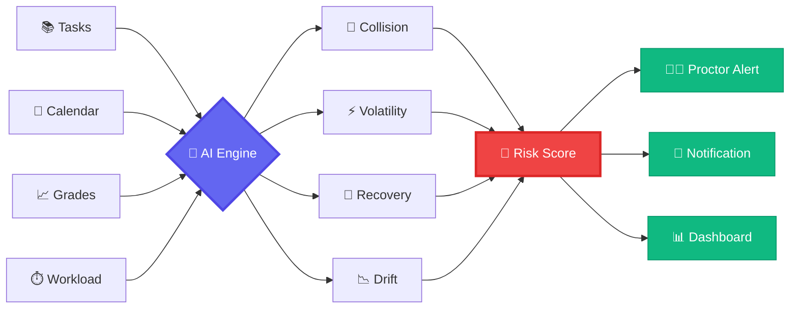
```mermaid
graph LR
    A[📚 Tasks] --> E{🧠 AI Engine}
    B[📅 Calendar] --> E
    C[📈 Grades] --> E
    D[⏱️ Workload] --> E
    
    E --> F[🎯 Collision]
    E --> G[⚡ Volatility]
    E --> H[🛌 Recovery]
    E --> I[📉 Drift]
    
    F --> J[🚨 Risk Score]
    G --> J
    H --> J
    I --> J
    
    J --> K[👨‍🏫 Proctor Alert]
    J --> L[📧 Notification]
    J --> M[📊 Dashboard]
    
    style E fill:#6366f1,stroke:#4f46e5,color:#fff,stroke-width:3px
    style J fill:#ef4444,stroke:#dc2626,color:#fff,stroke-width:3px
    style K fill:#10b981,stroke:#059669,color:#fff
    style L fill:#10b981,stroke:#059669,color:#fff
    style M fill:#10b981,stroke:#059669,color:#fff
```

---

## 🏗️ Complete System Architecture

### High-Level System Design

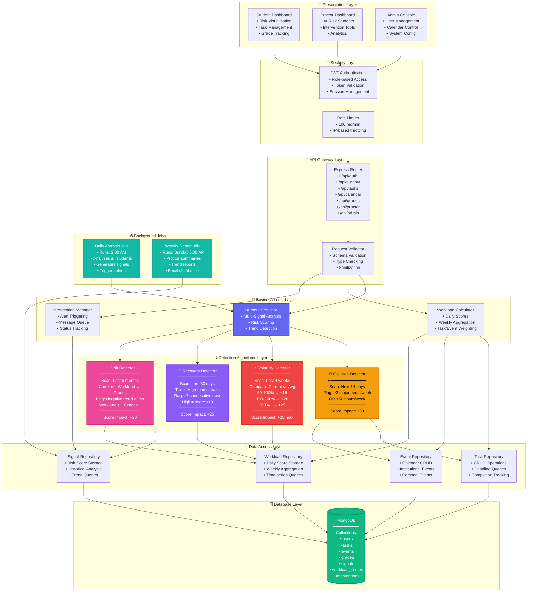
```mermaid
graph TB
    subgraph "🎨 Presentation Layer"
        UI1[Student Dashboard<br/>• Risk Visualization<br/>• Task Management<br/>• Grade Tracking]
        UI2[Proctor Dashboard<br/>• At-Risk Students<br/>• Intervention Tools<br/>• Analytics]
        UI3[Admin Console<br/>• User Management<br/>• Calendar Control<br/>• System Config]
    end
    
    subgraph "🔐 Security Layer"
        AUTH[JWT Authentication<br/>• Role-based Access<br/>• Token Validation<br/>• Session Management]
        RATE[Rate Limiter<br/>• 100 req/min<br/>• IP-based throttling]
    end
    
    subgraph "🔌 API Gateway Layer"
        ROUTER[Express Router<br/>• /api/auth<br/>• /api/burnout<br/>• /api/tasks<br/>• /api/calendar<br/>• /api/grades<br/>• /api/proctor<br/>• /api/admin]
        VALID[Request Validator<br/>• Schema Validation<br/>• Type Checking<br/>• Sanitization]
    end
    
    subgraph "🧠 Business Logic Layer"
        BP[Burnout Predictor<br/>• Multi-Signal Analysis<br/>• Risk Scoring<br/>• Trend Detection]
        WL[Workload Calculator<br/>• Daily Scores<br/>• Weekly Aggregation<br/>• Task/Event Weighting]
        INT[Intervention Manager<br/>• Alert Triggering<br/>• Message Queue<br/>• Status Tracking]
    end
    
    subgraph "🔍 Detection Algorithms Layer"
        D1[🎯 Collision Detector<br/>━━━━━━━━━━━━━━━<br/>Scan: Next 14 days<br/>Flag: ≥3 major items/week<br/>OR ≥50 hours/week<br/>━━━━━━━━━━━━━━━<br/>Score Impact: +30]
        
        D2[⚡ Volatility Detector<br/>━━━━━━━━━━━━━━━<br/>Scan: Last 4 weeks<br/>Compare: Current vs Avg<br/>50-100% → +15<br/>100-200% → +20<br/>200%+ → +25<br/>━━━━━━━━━━━━━━━<br/>Score Impact: +25 max]
        
        D3[🛌 Recovery Detector<br/>━━━━━━━━━━━━━━━<br/>Scan: Last 30 days<br/>Track: High-load streaks<br/>Flag: ≥7 consecutive days<br/>High = score >10<br/>━━━━━━━━━━━━━━━<br/>Score Impact: +25]
        
        D4[📉 Drift Detector<br/>━━━━━━━━━━━━━━━<br/>Scan: Last 6 months<br/>Correlate: Workload ↔ Grades<br/>Flag: Negative trend ≥3mo<br/>Workload ↑ + Grades ↓<br/>━━━━━━━━━━━━━━━<br/>Score Impact: +20]
    end
    
    subgraph "💾 Data Access Layer"
        DAO1[Task Repository<br/>• CRUD Operations<br/>• Deadline Queries<br/>• Completion Tracking]
        DAO2[Event Repository<br/>• Calendar CRUD<br/>• Institutional Events<br/>• Personal Events]
        DAO3[Signal Repository<br/>• Risk Score Storage<br/>• Historical Analysis<br/>• Trend Queries]
        DAO4[Workload Repository<br/>• Daily Score Storage<br/>• Weekly Aggregation<br/>• Time-series Queries]
    end
    
    subgraph "🗄️ Database Layer"
        DB[(MongoDB<br/>━━━━━━━━━━<br/>Collections:<br/>• users<br/>• tasks<br/>• events<br/>• grades<br/>• signals<br/>• workload_scores<br/>• interventions)]
    end
    
    subgraph "⏰ Background Jobs"
        CRON1[Daily Analysis Job<br/>• Runs: 2:00 AM<br/>• Analyzes all students<br/>• Generates signals<br/>• Triggers alerts]
        CRON2[Weekly Report Job<br/>• Runs: Sunday 6:00 AM<br/>• Proctor summaries<br/>• Trend reports<br/>• Email distribution]
    end
    
    UI1 --> AUTH
    UI2 --> AUTH
    UI3 --> AUTH
    
    AUTH --> RATE
    RATE --> ROUTER
    ROUTER --> VALID
    
    VALID --> BP
    VALID --> WL
    VALID --> INT
    
    BP --> D1
    BP --> D2
    BP --> D3
    BP --> D4
    
    D1 --> DAO1
    D1 --> DAO2
    D2 --> DAO4
    D3 --> DAO4
    D4 --> DAO3
    D4 --> DAO4
    
    WL --> DAO1
    WL --> DAO2
    WL --> DAO4
    
    INT --> DAO3
    
    DAO1 --> DB
    DAO2 --> DB
    DAO3 --> DB
    DAO4 --> DB
    
    CRON1 --> BP
    CRON2 --> DAO3
    
    style BP fill:#6366f1,stroke:#4f46e5,color:#fff,stroke-width:3px
    style D1 fill:#f59e0b,stroke:#d97706,color:#000,stroke-width:2px
    style D2 fill:#ef4444,stroke:#dc2626,color:#fff,stroke-width:2px
    style D3 fill:#8b5cf6,stroke:#7c3aed,color:#fff,stroke-width:2px
    style D4 fill:#ec4899,stroke:#db2777,color:#fff,stroke-width:2px
    style DB fill:#10b981,stroke:#059669,color:#fff,stroke-width:3px
    style CRON1 fill:#14b8a6,stroke:#0d9488,color:#fff
    style CRON2 fill:#14b8a6,stroke:#0d9488,color:#fff
```

---

## 🔄 Complete Data Flow Architecture

### Request-Response Flow

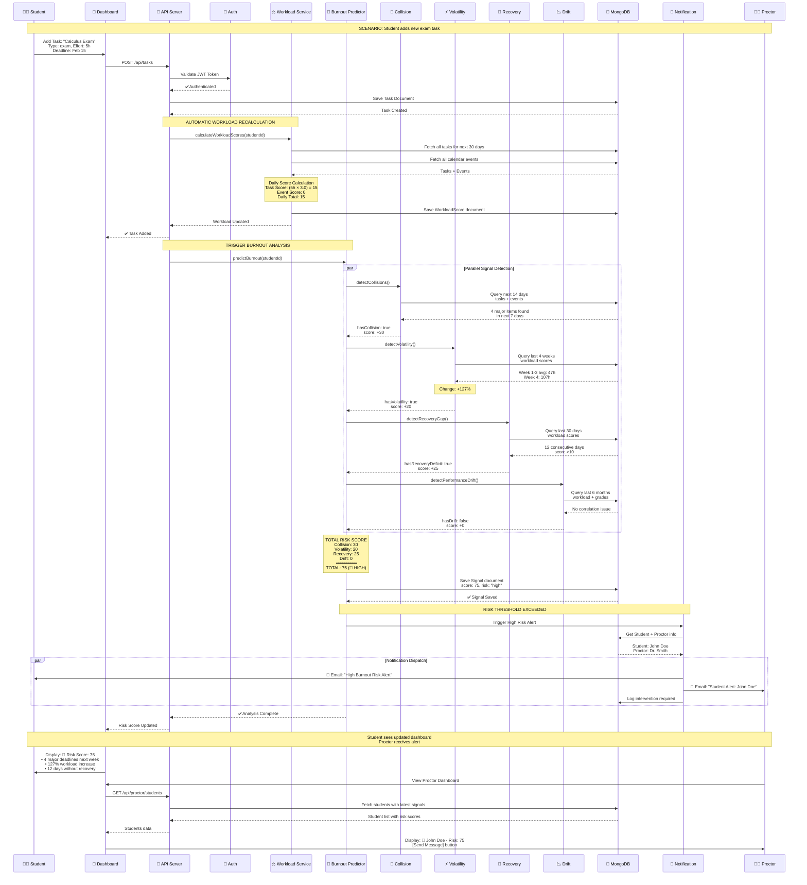
```mermaid
sequenceDiagram
    participant S as 👨‍🎓 Student
    participant UI as 🎨 Dashboard
    participant API as 🔌 API Server
    participant AUTH as 🔐 Auth
    participant WL as ⚖️ Workload Service
    participant BP as 🧠 Burnout Predictor
    participant D1 as 🎯 Collision
    participant D2 as ⚡ Volatility
    participant D3 as 🛌 Recovery
    participant D4 as 📉 Drift
    participant DB as 💾 MongoDB
    participant NOTIF as 📧 Notification
    participant P as 👨‍🏫 Proctor
    
    Note over S,P: SCENARIO: Student adds new exam task
    
    S->>UI: Add Task: "Calculus Exam"<br/>Type: exam, Effort: 5h<br/>Deadline: Feb 15
    UI->>API: POST /api/tasks
    API->>AUTH: Validate JWT Token
    AUTH-->>API: ✅ Authenticated
    API->>DB: Save Task Document
    DB-->>API: Task Created
    
    Note over API,WL: AUTOMATIC WORKLOAD RECALCULATION
    
    API->>WL: calculateWorkloadScores(studentId)
    WL->>DB: Fetch all tasks for next 30 days
    WL->>DB: Fetch all calendar events
    DB-->>WL: Tasks + Events
    
    Note over WL: Daily Score Calculation<br/>Task Score: (5h × 3.0) = 15<br/>Event Score: 0<br/>Daily Total: 15
    
    WL->>DB: Save WorkloadScore document
    WL-->>API: Workload Updated
    API-->>UI: ✅ Task Added
    
    Note over API,BP: TRIGGER BURNOUT ANALYSIS
    
    API->>BP: predictBurnout(studentId)
    
    par Parallel Signal Detection
        BP->>D1: detectCollisions()
        D1->>DB: Query next 14 days<br/>tasks + events
        DB-->>D1: 4 major items found<br/>in next 7 days
        D1-->>BP: hasCollision: true<br/>score: +30
        
        BP->>D2: detectVolatility()
        D2->>DB: Query last 4 weeks<br/>workload scores
        DB-->>D2: Week 1-3 avg: 47h<br/>Week 4: 107h
        Note over D2: Change: +127%
        D2-->>BP: hasVolatility: true<br/>score: +20
        
        BP->>D3: detectRecoveryGap()
        D3->>DB: Query last 30 days<br/>workload scores
        DB-->>D3: 12 consecutive days<br/>score >10
        D3-->>BP: hasRecoveryDeficit: true<br/>score: +25
        
        BP->>D4: detectPerformanceDrift()
        D4->>DB: Query last 6 months<br/>workload + grades
        DB-->>D4: No correlation issue
        D4-->>BP: hasDrift: false<br/>score: +0
    end
    
    Note over BP: TOTAL RISK SCORE<br/>Collision: 30<br/>Volatility: 20<br/>Recovery: 25<br/>Drift: 0<br/>━━━━━━━━━━<br/>TOTAL: 75 (🔴 HIGH)
    
    BP->>DB: Save Signal document<br/>score: 75, risk: "high"
    DB-->>BP: ✅ Signal Saved
    
    Note over BP,NOTIF: RISK THRESHOLD EXCEEDED
    
    BP->>NOTIF: Trigger High Risk Alert
    NOTIF->>DB: Get Student + Proctor info
    DB-->>NOTIF: Student: John Doe<br/>Proctor: Dr. Smith
    
    par Notification Dispatch
        NOTIF->>S: 📧 Email: "High Burnout Risk Alert"
        NOTIF->>P: 📧 Email: "Student Alert: John Doe"
        NOTIF->>DB: Log intervention required
    end
    
    BP-->>API: ✅ Analysis Complete
    API-->>UI: Risk Score Updated
    
    Note over S,P: Student sees updated dashboard<br/>Proctor receives alert
    
    UI->>S: Display: 🔴 Risk Score: 75<br/>• 4 major deadlines next week<br/>• 127% workload increase<br/>• 12 days without recovery
    
    P->>UI: View Proctor Dashboard
    UI->>API: GET /api/proctor/students
    API->>DB: Fetch students with latest signals
    DB-->>API: Student list with risk scores
    API-->>UI: Students data
    UI->>P: Display: 🚨 John Doe - Risk: 75<br/>[Send Message] button
```

---

## 🧬 Burnout Prediction Algorithm

### Multi-Signal Detection System

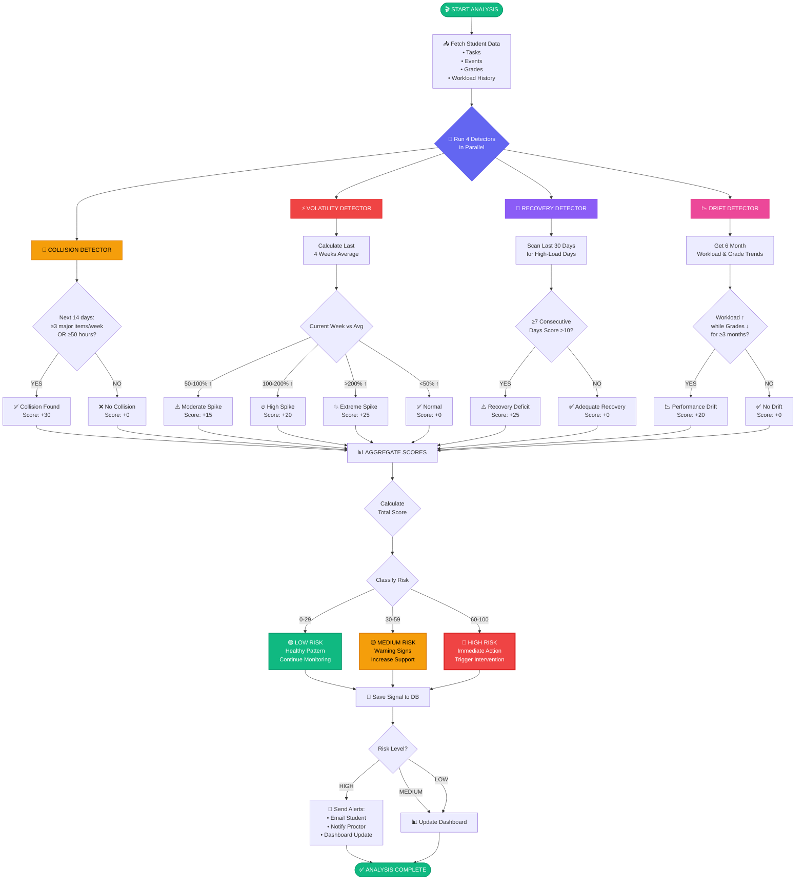
```mermaid
flowchart TD
    START([🎬 START ANALYSIS]) --> FETCH[📥 Fetch Student Data<br/>• Tasks<br/>• Events<br/>• Grades<br/>• Workload History]
    
    FETCH --> PARALLEL{🔀 Run 4 Detectors<br/>in Parallel}
    
    PARALLEL --> C1[🎯 COLLISION DETECTOR]
    PARALLEL --> V1[⚡ VOLATILITY DETECTOR]
    PARALLEL --> R1[🛌 RECOVERY DETECTOR]
    PARALLEL --> D1[📉 DRIFT DETECTOR]
    
    C1 --> C2{Next 14 days:<br/>≥3 major items/week<br/>OR ≥50 hours?}
    C2 -->|YES| C3[✅ Collision Found<br/>Score: +30]
    C2 -->|NO| C4[❌ No Collision<br/>Score: +0]
    
    V1 --> V2[Calculate Last<br/>4 Weeks Average]
    V2 --> V3{Current Week vs Avg}
    V3 -->|50-100% ↑| V4[⚠️ Moderate Spike<br/>Score: +15]
    V3 -->|100-200% ↑| V5[🔥 High Spike<br/>Score: +20]
    V3 -->|>200% ↑| V6[💥 Extreme Spike<br/>Score: +25]
    V3 -->|<50% ↑| V7[✅ Normal<br/>Score: +0]
    
    R1 --> R2[Scan Last 30 Days<br/>for High-Load Days]
    R2 --> R3{≥7 Consecutive<br/>Days Score >10?}
    R3 -->|YES| R4[⚠️ Recovery Deficit<br/>Score: +25]
    R3 -->|NO| R5[✅ Adequate Recovery<br/>Score: +0]
    
    D1 --> D2[Get 6 Month<br/>Workload & Grade Trends]
    D2 --> D3{Workload ↑<br/>while Grades ↓<br/>for ≥3 months?}
    D3 -->|YES| D4[📉 Performance Drift<br/>Score: +20]
    D3 -->|NO| D5[✅ No Drift<br/>Score: +0]
    
    C3 --> AGG[📊 AGGREGATE SCORES]
    C4 --> AGG
    V4 --> AGG
    V5 --> AGG
    V6 --> AGG
    V7 --> AGG
    R4 --> AGG
    R5 --> AGG
    D4 --> AGG
    D5 --> AGG
    
    AGG --> TOTAL{Calculate<br/>Total Score}
    
    TOTAL --> CLASS{Classify Risk}
    CLASS -->|0-29| LOW[🟢 LOW RISK<br/>Healthy Pattern<br/>Continue Monitoring]
    CLASS -->|30-59| MED[🟡 MEDIUM RISK<br/>Warning Signs<br/>Increase Support]
    CLASS -->|60-100| HIGH[🔴 HIGH RISK<br/>Immediate Action<br/>Trigger Intervention]
    
    LOW --> SAVE[💾 Save Signal to DB]
    MED --> SAVE
    HIGH --> SAVE
    
    SAVE --> NOTIFY{Risk Level?}
    NOTIFY -->|HIGH| ALERT[🚨 Send Alerts:<br/>• Email Student<br/>• Notify Proctor<br/>• Dashboard Update]
    NOTIFY -->|MEDIUM| DASH[📊 Update Dashboard]
    NOTIFY -->|LOW| DASH
    
    ALERT --> END([✅ ANALYSIS COMPLETE])
    DASH --> END
    
    style START fill:#10b981,stroke:#059669,color:#fff
    style PARALLEL fill:#6366f1,stroke:#4f46e5,color:#fff
    style C1 fill:#f59e0b,stroke:#d97706,color:#000
    style V1 fill:#ef4444,stroke:#dc2626,color:#fff
    style R1 fill:#8b5cf6,stroke:#7c3aed,color:#fff
    style D1 fill:#ec4899,stroke:#db2777,color:#fff
    style HIGH fill:#ef4444,stroke:#dc2626,color:#fff,stroke-width:3px
    style MED fill:#f59e0b,stroke:#d97706,color:#000,stroke-width:2px
    style LOW fill:#10b981,stroke:#059669,color:#fff,stroke-width:2px
    style END fill:#10b981,stroke:#059669,color:#fff
```

---

## 📊 Workload Calculation Engine

### Task & Event Scoring System

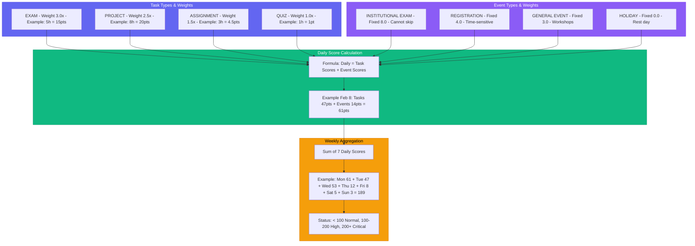
```mermaid
graph TB
    subgraph TASKS["Task Types & Weights"]
        T1["EXAM - Weight 3.0x - Example: 5h = 15pts"]
        T2["PROJECT - Weight 2.5x - Example: 8h = 20pts"]
        T3["ASSIGNMENT - Weight 1.5x - Example: 3h = 4.5pts"]
        T4["QUIZ - Weight 1.0x - Example: 1h = 1pt"]
    end
    
    subgraph EVENTS["Event Types & Weights"]
        E1["INSTITUTIONAL EXAM - Fixed 8.0 - Cannot skip"]
        E2["REGISTRATION - Fixed 4.0 - Time-sensitive"]
        E3["GENERAL EVENT - Fixed 3.0 - Workshops"]
        E4["HOLIDAY - Fixed 0.0 - Rest day"]
    end
    
    subgraph CALC["Daily Score Calculation"]
        C1["Formula: Daily = Task Scores + Event Scores"]
        C2["Example Feb 8: Tasks 47pts + Events 14pts = 61pts"]
    end
    
    subgraph WEEK["Weekly Aggregation"]
        W1["Sum of 7 Daily Scores"]
        W2["Example: Mon 61 + Tue 47 + Wed 53 + Thu 12 + Fri 8 + Sat 5 + Sun 3 = 189"]
        W3["Status: < 100 Normal, 100-200 High, 200+ Critical"]
    end
    
    T1 --> C1
    T2 --> C1
    T3 --> C1
    T4 --> C1
    E1 --> C1
    E2 --> C1
    E3 --> C1
    E4 --> C1
    
    C1 --> C2
    C2 --> W1
    W1 --> W2
    W2 --> W3
    
    style TASKS fill:#6366f1,stroke:#4f46e5,color:#fff
    style EVENTS fill:#8b5cf6,stroke:#7c3aed,color:#fff
    style CALC fill:#10b981,stroke:#059669,color:#fff
    style WEEK fill:#f59e0b,stroke:#d97706,color:#000
```

---

## 🗄️ Database Architecture

### Complete Entity Relationship Diagram

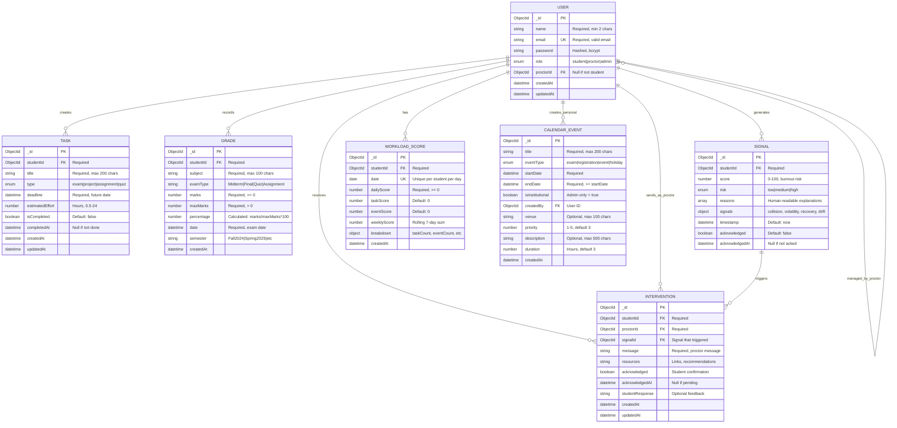
```mermaid
erDiagram
    USER ||--o{ TASK : "creates"
    USER ||--o{ GRADE : "records"
    USER ||--o{ SIGNAL : "generates"
    USER ||--o{ WORKLOAD_SCORE : "has"
    USER ||--o{ CALENDAR_EVENT : "creates_personal"
    USER ||--o{ INTERVENTION : "receives"
    USER ||--o{ INTERVENTION : "sends_as_proctor"
    USER }o--|| USER : "managed_by_proctor"
    SIGNAL ||--o{ INTERVENTION : "triggers"
    
    USER {
        ObjectId _id PK
        string name "Required, min 2 chars"
        string email UK "Required, valid email"
        string password "Hashed, bcrypt"
        enum role "student|proctor|admin"
        ObjectId proctorId FK "Null if not student"
        datetime createdAt
        datetime updatedAt
    }
    
    TASK {
        ObjectId _id PK
        ObjectId studentId FK "Required"
        string title "Required, max 200 chars"
        enum type "exam|project|assignment|quiz"
        datetime deadline "Required, future date"
        number estimatedEffort "Hours, 0.5-24"
        boolean isCompleted "Default: false"
        datetime completedAt "Null if not done"
        datetime createdAt
        datetime updatedAt
    }
    
    CALENDAR_EVENT {
        ObjectId _id PK
        string title "Required, max 200 chars"
        enum eventType "exam|registration|event|holiday"
        datetime startDate "Required"
        datetime endDate "Required, >= startDate"
        boolean isInstitutional "Admin only = true"
        ObjectId createdBy FK "User ID"
        string venue "Optional, max 100 chars"
        number priority "1-5, default 3"
        string description "Optional, max 500 chars"
        number duration "Hours, default 3"
        datetime createdAt
    }
    
    GRADE {
        ObjectId _id PK
        ObjectId studentId FK "Required"
        string subject "Required, max 100 chars"
        string examType "Midterm|Final|Quiz|Assignment"
        number marks "Required, >= 0"
        number maxMarks "Required, > 0"
        number percentage "Calculated: marks/maxMarks*100"
        datetime date "Required, exam date"
        string semester "Fall2024|Spring2025|etc"
        datetime createdAt
    }
    
    WORKLOAD_SCORE {
        ObjectId _id PK
        ObjectId studentId FK "Required"
        date date UK "Unique per student per day"
        number dailyScore "Required, >= 0"
        number taskScore "Default: 0"
        number eventScore "Default: 0"
        number weeklyScore "Rolling 7-day sum"
        object breakdown "taskCount, eventCount, etc"
        datetime createdAt
    }
    
    SIGNAL {
        ObjectId _id PK
        ObjectId studentId FK "Required"
        number score "0-100, burnout risk"
        enum risk "low|medium|high"
        array reasons "Human-readable explanations"
        object signals "collision, volatility, recovery, drift"
        datetime timestamp "Default: now"
        boolean acknowledged "Default: false"
        datetime acknowledgedAt "Null if not acked"
    }
    
    INTERVENTION {
        ObjectId _id PK
        ObjectId studentId FK "Required"
        ObjectId proctorId FK "Required"
        ObjectId signalId FK "Signal that triggered"
        string message "Required, proctor message"
        string resources "Links, recommendations"
        boolean acknowledged "Student confirmation"
        datetime acknowledgedAt "Null if pending"
        string studentResponse "Optional feedback"
        datetime createdAt
        datetime updatedAt
    }
```

### Data Flow Between Collections

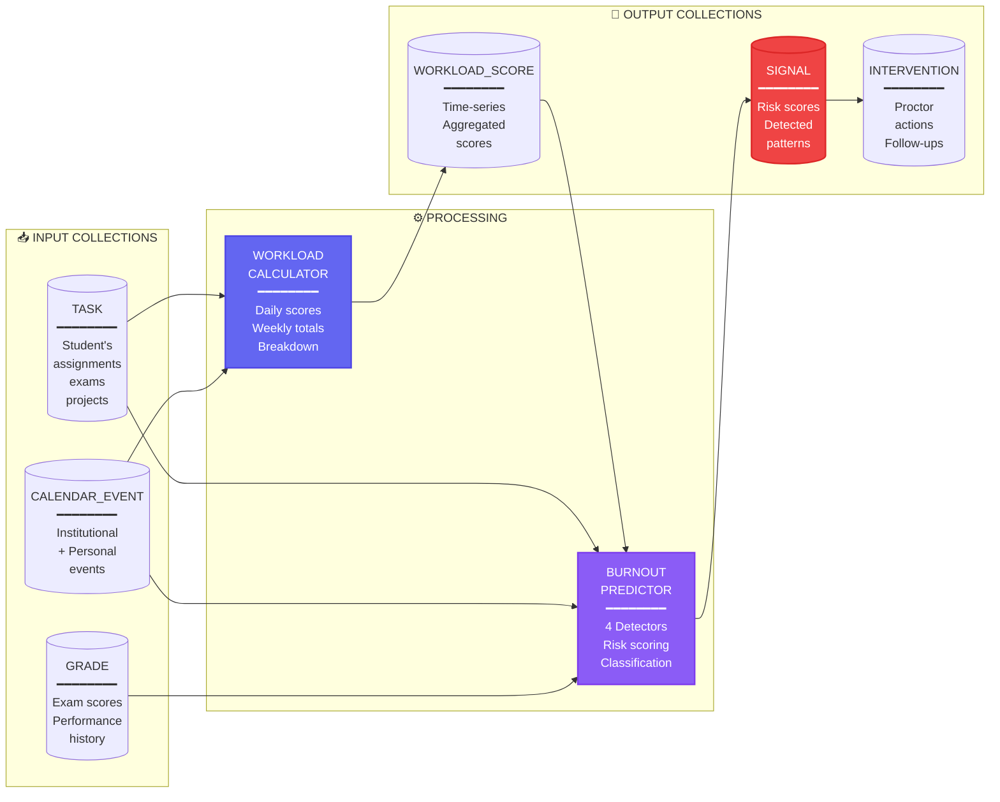
```mermaid
flowchart LR
    subgraph "📥 INPUT COLLECTIONS"
        TASK[(TASK<br/>━━━━━━━━<br/>Student's<br/>assignments<br/>exams<br/>projects)]
        EVENT[(CALENDAR_EVENT<br/>━━━━━━━━<br/>Institutional<br/>+ Personal<br/>events)]
        GRADE[(GRADE<br/>━━━━━━━━<br/>Exam scores<br/>Performance<br/>history)]
    end
    
    subgraph "⚙️ PROCESSING"
        WL[WORKLOAD<br/>CALCULATOR<br/>━━━━━━━━<br/>Daily scores<br/>Weekly totals<br/>Breakdown]
        BP[BURNOUT<br/>PREDICTOR<br/>━━━━━━━━<br/>4 Detectors<br/>Risk scoring<br/>Classification]
    end
    
    subgraph "💾 OUTPUT COLLECTIONS"
        WLSCORE[(WORKLOAD_SCORE<br/>━━━━━━━━<br/>Time-series<br/>Aggregated<br/>scores)]
        SIG[(SIGNAL<br/>━━━━━━━━<br/>Risk scores<br/>Detected<br/>patterns)]
        INT[(INTERVENTION<br/>━━━━━━━━<br/>Proctor<br/>actions<br/>Follow-ups)]
    end
    
    TASK --> WL
    EVENT --> WL
    WL --> WLSCORE
    
    WLSCORE --> BP
    TASK --> BP
    EVENT --> BP
    GRADE --> BP
    
    BP --> SIG
    SIG --> INT
    
    style WL fill:#6366f1,stroke:#4f46e5,color:#fff,stroke-width:2px
    style BP fill:#8b5cf6,stroke:#7c3aed,color:#fff,stroke-width:2px
    style SIG fill:#ef4444,stroke:#dc2626,color:#fff,stroke-width:2px
```

---

## 🔍 Signal Detector Deep Dive

### 1. Collision Detector - Deadline Overload Analysis

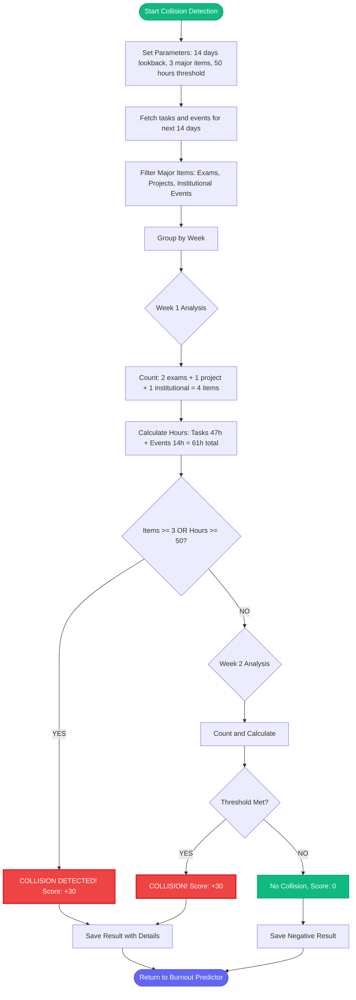
```mermaid
flowchart TD
    START([Start Collision Detection]) --> PARAM[Set Parameters: 14 days lookback, 3 major items, 50 hours threshold]
    
    PARAM --> FETCH[Fetch tasks and events for next 14 days]
    
    FETCH --> FILTER[Filter Major Items: Exams, Projects, Institutional Events]
    
    FILTER --> GROUP[Group by Week]
    
    GROUP --> WEEK1{Week 1 Analysis}
    
    WEEK1 --> COUNT1[Count: 2 exams + 1 project + 1 institutional = 4 items]
    
    COUNT1 --> HOURS1[Calculate Hours: Tasks 47h + Events 14h = 61h total]
    
    HOURS1 --> CHECK1{Items >= 3 OR Hours >= 50?}
    CHECK1 -->|YES| COL1[COLLISION DETECTED! Score: +30]
    CHECK1 -->|NO| WEEK2{Week 2 Analysis}
    
    WEEK2 --> COUNT2[Count and Calculate]
    COUNT2 --> CHECK2{Threshold Met?}
    CHECK2 -->|YES| COL2[COLLISION! Score: +30]
    CHECK2 -->|NO| NOCOL[No Collision, Score: 0]
    
    COL1 --> SAVE[Save Result with Details]
    COL2 --> SAVE
    NOCOL --> SAVE2[Save Negative Result]
    
    SAVE --> RETURN([Return to Burnout Predictor])
    SAVE2 --> RETURN
    
    style START fill:#10b981,stroke:#059669,color:#fff
    style COL1 fill:#ef4444,stroke:#dc2626,color:#fff,stroke-width:3px
    style COL2 fill:#ef4444,stroke:#dc2626,color:#fff,stroke-width:3px
    style NOCOL fill:#10b981,stroke:#059669,color:#fff
    style RETURN fill:#6366f1,stroke:#4f46e5,color:#fff
```

### 2. Volatility Detector - Workload Spike Analysis

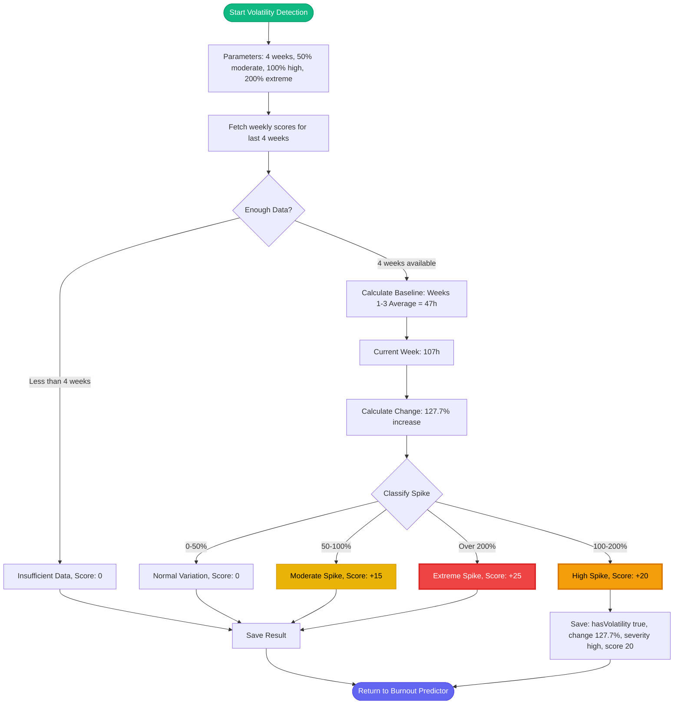
```mermaid
flowchart TD
    START([Start Volatility Detection]) --> PARAM[Parameters: 4 weeks, 50% moderate, 100% high, 200% extreme]
    
    PARAM --> FETCH[Fetch weekly scores for last 4 weeks]
    
    FETCH --> DATA{Enough Data?}
    DATA -->|Less than 4 weeks| NODATA[Insufficient Data, Score: 0]
    DATA -->|4 weeks available| CALC[Calculate Baseline: Weeks 1-3 Average = 47h]
    
    CALC --> CURRENT[Current Week: 107h]
    
    CURRENT --> CHANGE[Calculate Change: 127.7% increase]
    
    CHANGE --> CLASS{Classify Spike}
    
    CLASS -->|0-50%| NORMAL[Normal Variation, Score: 0]
    CLASS -->|50-100%| MODERATE[Moderate Spike, Score: +15]
    CLASS -->|100-200%| HIGH[High Spike, Score: +20]
    CLASS -->|Over 200%| EXTREME[Extreme Spike, Score: +25]
    
    NODATA --> SAVE[Save Result]
    NORMAL --> SAVE
    MODERATE --> SAVE
    HIGH --> SAVE2[Save: hasVolatility true, change 127.7%, severity high, score 20]
    EXTREME --> SAVE
    
    SAVE --> RETURN([Return to Burnout Predictor])
    SAVE2 --> RETURN
    
    style START fill:#10b981,stroke:#059669,color:#fff
    style HIGH fill:#f59e0b,stroke:#d97706,color:#000,stroke-width:3px
    style EXTREME fill:#ef4444,stroke:#dc2626,color:#fff,stroke-width:3px
    style MODERATE fill:#eab308,stroke:#ca8a04,color:#000
    style RETURN fill:#6366f1,stroke:#4f46e5,color:#fff
```

### 3. Recovery Detector - Rest Period Analysis

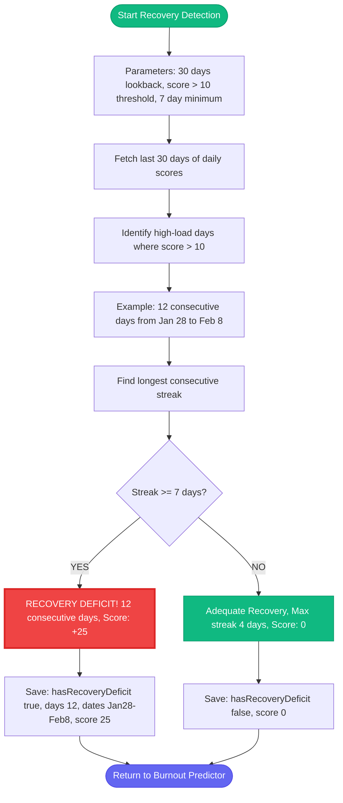
```mermaid
flowchart TD
    START([Start Recovery Detection]) --> PARAM[Parameters: 30 days lookback, score > 10 threshold, 7 day minimum]
    
    PARAM --> FETCH[Fetch last 30 days of daily scores]
    
    FETCH --> IDENTIFY[Identify high-load days where score > 10]
    
    IDENTIFY --> EXAMPLE[Example: 12 consecutive days from Jan 28 to Feb 8]
    
    EXAMPLE --> STREAK[Find longest consecutive streak]
    
    STREAK --> CHECK{Streak >= 7 days?}
    
    CHECK -->|YES| DEFICIT[RECOVERY DEFICIT! 12 consecutive days, Score: +25]
    
    CHECK -->|NO| ADEQUATE[Adequate Recovery, Max streak 4 days, Score: 0]
    
    DEFICIT --> SAVE[Save: hasRecoveryDeficit true, days 12, dates Jan28-Feb8, score 25]
    
    ADEQUATE --> SAVE2[Save: hasRecoveryDeficit false, score 0]
    
    SAVE --> RETURN([Return to Burnout Predictor])
    SAVE2 --> RETURN
    
    style START fill:#10b981,stroke:#059669,color:#fff
    style DEFICIT fill:#ef4444,stroke:#dc2626,color:#fff,stroke-width:3px
    style ADEQUATE fill:#10b981,stroke:#059669,color:#fff
    style RETURN fill:#6366f1,stroke:#4f46e5,color:#fff
```

### 4. Drift Detector - Performance Correlation Analysis

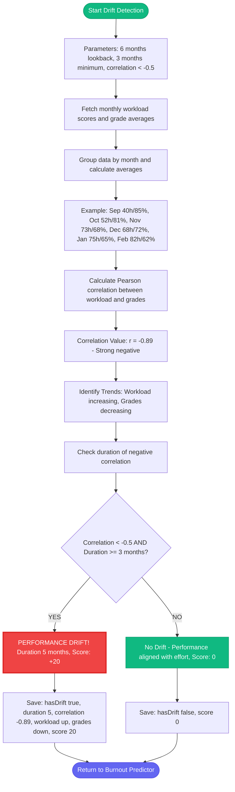
```mermaid
flowchart TD
    START([Start Drift Detection]) --> PARAM[Parameters: 6 months lookback, 3 months minimum, correlation < -0.5]
    
    PARAM --> FETCH[Fetch monthly workload scores and grade averages]
    
    FETCH --> GROUP[Group data by month and calculate averages]
    
    GROUP --> EXAMPLE[Example: Sep 40h/85%, Oct 52h/81%, Nov 73h/68%, Dec 68h/72%, Jan 75h/65%, Feb 82h/62%]
    
    EXAMPLE --> CORR[Calculate Pearson correlation between workload and grades]
    
    CORR --> VALUE[Correlation Value: r = -0.89 - Strong negative]
    
    VALUE --> TREND[Identify Trends: Workload increasing, Grades decreasing]
    
    TREND --> DURATION[Check duration of negative correlation]
    
    DURATION --> CHECK{Correlation < -0.5 AND Duration >= 3 months?}
    
    CHECK -->|YES| DRIFT[PERFORMANCE DRIFT! Duration 5 months, Score: +20]
    
    CHECK -->|NO| NODRIFT[No Drift - Performance aligned with effort, Score: 0]
    
    DRIFT --> SAVE[Save: hasDrift true, duration 5, correlation -0.89, workload up, grades down, score 20]
    
    NODRIFT --> SAVE2[Save: hasDrift false, score 0]
    
    SAVE --> RETURN([Return to Burnout Predictor])
    SAVE2 --> RETURN
    
    style START fill:#10b981,stroke:#059669,color:#fff
    style DRIFT fill:#ef4444,stroke:#dc2626,color:#fff,stroke-width:3px
    style NODRIFT fill:#10b981,stroke:#059669,color:#fff
    style RETURN fill:#6366f1,stroke:#4f46e5,color:#fff
```

---

## 📡 Complete API Architecture

### API Route Hierarchy


```mermaid
graph TB
    ROOT["API Server"]
    
    ROOT --> AUTH["api/auth"]
    ROOT --> BURN["api/burnout"]
    ROOT --> TASK["api/tasks"]
    ROOT --> CAL["api/calendar"]
    ROOT --> GRADE["api/grades"]
    ROOT --> WL["api/workload"]
    ROOT --> PROC["api/proctor"]
    ROOT --> ADM["api/admin"]
    
    AUTH --> A1["POST /register"]
    AUTH --> A2["POST /login"]
    AUTH --> A3["GET /profile"]
    AUTH --> A4["PUT /profile"]
    
    BURN --> B1["GET /analysis"]
    BURN --> B2["GET /history"]
    BURN --> B3["POST /predict/:id"]
    BURN --> B4["GET /recommendations"]
    
    TASK --> T1["GET /"]
    TASK --> T2["POST /"]
    TASK --> T3["PUT /:id"]
    TASK --> T4["DELETE /:id"]
    TASK --> T5["PATCH /:id/complete"]
    
    CAL --> C1["GET /all"]
    CAL --> C2["GET /institutional"]
    CAL --> C3["POST /personal"]
    CAL --> C4["DELETE /:id"]
    
    GRADE --> G1["GET /"]
    GRADE --> G2["POST /"]
    GRADE --> G3["GET /analytics"]
    GRADE --> G4["DELETE /:id"]
    
    WL --> W1["GET /"]
    WL --> W2["GET /breakdown"]
    WL --> W3["POST /recalculate"]
    
    PROC --> P1["GET /students"]
    PROC --> P2["GET /student/:id"]
    PROC --> P3["POST /intervene"]
    PROC --> P4["GET /analytics"]
    PROC --> P5["GET /interventions"]
    
    ADM --> AD1["GET /users"]
    ADM --> AD2["POST /users"]
    ADM --> AD3["PUT /users/:id"]
    ADM --> AD4["DELETE /users/:id"]
    ADM --> AD5["POST /calendar/upload"]
    ADM --> AD6["GET /analytics"]
    
    style ROOT fill:#6366f1,stroke:#4f46e5,color:#fff,stroke-width:3px
    style BURN fill:#ef4444,stroke:#dc2626,color:#fff,stroke-width:2px
    style PROC fill:#10b981,stroke:#059669,color:#fff,stroke-width:2px
    style ADM fill:#f59e0b,stroke:#d97706,color:#000,stroke-width:2px
```

### Authentication & Authorization Flow

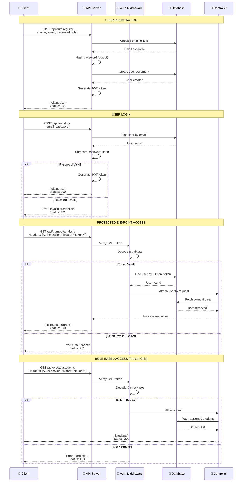
```mermaid
sequenceDiagram
    participant C as 👤 Client
    participant API as 🔌 API Server
    participant AUTH as 🔐 Auth Middleware
    participant DB as 💾 Database
    participant CTRL as 🎯 Controller
    
    Note over C,CTRL: USER REGISTRATION
    
    C->>API: POST /api/auth/register<br/>{name, email, password, role}
    API->>DB: Check if email exists
    DB-->>API: Email available
    API->>API: Hash password (bcrypt)
    API->>DB: Create user document
    DB-->>API: User created
    API->>API: Generate JWT token
    API-->>C: {token, user}<br/>Status: 201
    
    Note over C,CTRL: USER LOGIN
    
    C->>API: POST /api/auth/login<br/>{email, password}
    API->>DB: Find user by email
    DB-->>API: User found
    API->>API: Compare password hash
    alt Password Valid
        API->>API: Generate JWT token
        API-->>C: {token, user}<br/>Status: 200
    else Password Invalid
        API-->>C: Error: Invalid credentials<br/>Status: 401
    end
    
    Note over C,CTRL: PROTECTED ENDPOINT ACCESS
    
    C->>API: GET /api/burnout/analysis<br/>Headers: {Authorization: "Bearer <token>"}
    API->>AUTH: Verify JWT token
    AUTH->>AUTH: Decode & validate
    alt Token Valid
        AUTH->>DB: Find user by ID from token
        DB-->>AUTH: User found
        AUTH->>CTRL: Attach user to request
        CTRL->>DB: Fetch burnout data
        DB-->>CTRL: Data retrieved
        CTRL-->>API: Process response
        API-->>C: {score, risk, signals}<br/>Status: 200
    else Token Invalid/Expired
        AUTH-->>C: Error: Unauthorized<br/>Status: 401
    end
    
    Note over C,CTRL: ROLE-BASED ACCESS (Proctor Only)
    
    C->>API: GET /api/proctor/students<br/>Headers: {Authorization: "Bearer <token>"}
    API->>AUTH: Verify JWT token
    AUTH->>AUTH: Decode & check role
    alt Role = Proctor
        AUTH->>CTRL: Allow access
        CTRL->>DB: Fetch assigned students
        DB-->>CTRL: Student list
        CTRL-->>C: {students}<br/>Status: 200
    else Role ≠ Proctor
        AUTH-->>C: Error: Forbidden<br/>Status: 403
    end
```

---

## 🚀 Quick Start

### Installation (5 Minutes)

```bash
# 1️⃣ Clone repository
git clone https://github.com/yourusername/burnout-prediction-system.git
cd burnout-prediction-system

# 2️⃣ Backend setup
cd backend
npm install

# 3️⃣ Environment configuration
cp .env.example .env
# Edit .env with your MongoDB URI

# 4️⃣ Start MongoDB (if local)
mongod --dbpath /path/to/data

# 5️⃣ Start server
npm start
# ✅ Server running on http://localhost:3000

# 6️⃣ Open frontend
# Navigate to frontend/pages/login.html
```

### Environment Variables

```env
# 🗄️ Database
MONGODB_URI=mongodb://localhost:27017/burnout-system
MONGODB_TEST_URI=mongodb://localhost:27017/burnout-test

# 🔐 Authentication
JWT_SECRET=your_super_secret_key_minimum_32_characters_long
JWT_EXPIRES_IN=7d

# 🌐 Server
PORT=3000
NODE_ENV=development

# 📧 Email Notifications (Optional)
SMTP_HOST=smtp.gmail.com
SMTP_PORT=587
SMTP_USER=noreply@yourdomain.com
SMTP_PASS=your_app_password_here

# ⏰ Scheduled Jobs
ENABLE_DAILY_ANALYSIS=true
DAILY_ANALYSIS_TIME=02:00

# 📊 System Configuration
HIGH_RISK_THRESHOLD=60
MEDIUM_RISK_THRESHOLD=30
COLLISION_THRESHOLD=3
VOLATILITY_MODERATE=50
VOLATILITY_HIGH=100
VOLATILITY_EXTREME=200
```

---

## 📊 Real-World Example

### Complete Student Journey

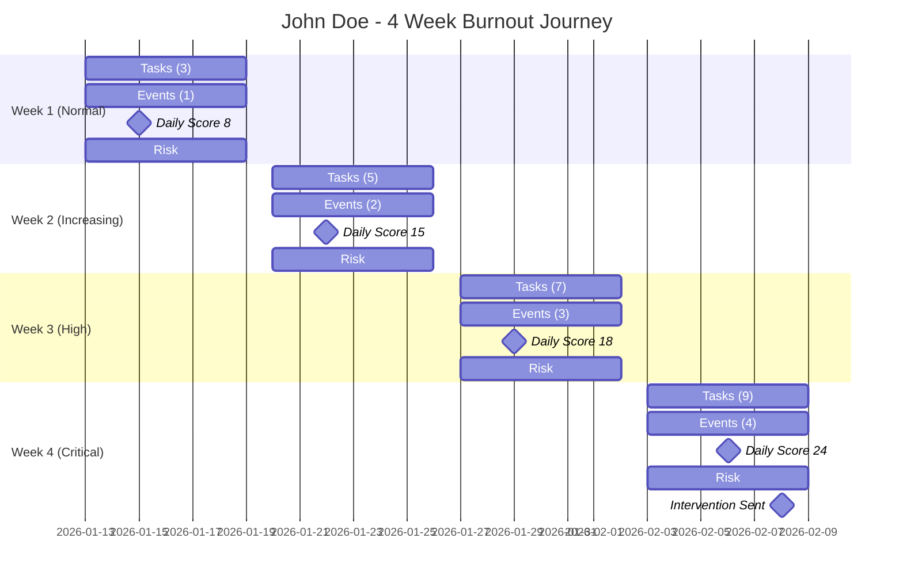
```mermaid
gantt
    title John Doe - 4 Week Burnout Journey
    dateFormat YYYY-MM-DD
    section Week 1 (Normal)
    Tasks (3) :2026-01-13, 2026-01-19
    Events (1) :2026-01-13, 2026-01-19
    Daily Score 8 :milestone, 2026-01-15, 0d
    Risk: LOW 🟢 :crit, 2026-01-13, 2026-01-19
    
    section Week 2 (Increasing)
    Tasks (5) :2026-01-20, 2026-01-26
    Events (2) :2026-01-20, 2026-01-26
    Daily Score 15 :milestone, 2026-01-22, 0d
    Risk: LOW 🟢 :crit, 2026-01-20, 2026-01-26
    
    section Week 3 (High)
    Tasks (7) :2026-01-27, 2026-02-02
    Events (3) :2026-01-27, 2026-02-02
    Daily Score 18 :milestone, 2026-01-29, 0d
    Risk: MEDIUM 🟡 :2026-01-27, 2026-02-02
    
    section Week 4 (Critical)
    Tasks (9) :2026-02-03, 2026-02-09
    Events (4) :2026-02-03, 2026-02-09
    Daily Score 24 :milestone, 2026-02-06, 0d
    Risk: HIGH 🔴 :active, 2026-02-03, 2026-02-09
    Intervention Sent :milestone, 2026-02-08, 0d
```

### Detailed Week 4 Breakdown

<table>
<tr>
<th>Date</th>
<th>Tasks</th>
<th>Events</th>
<th>Daily Score</th>
<th>Status</th>
</tr>
<tr>
<td><b>Feb 3 Mon</b></td>
<td>2 Assignments (6h)</td>
<td>Workshop (3h)</td>
<td>15</td>
<td>🟡 High</td>
</tr>
<tr>
<td><b>Feb 4 Tue</b></td>
<td>1 Quiz (1h)</td>
<td>-</td>
<td>8</td>
<td>🟢 Normal</td>
</tr>
<tr>
<td><b>Feb 5 Wed</b></td>
<td>1 Exam (5h)</td>
<td>Registration (4h)</td>
<td>23</td>
<td>🔴 Critical</td>
</tr>
<tr>
<td><b>Feb 6 Thu</b></td>
<td>1 Project (8h)</td>
<td>Tour (8h)</td>
<td>44</td>
<td>🔴 Critical</td>
</tr>
<tr>
<td><b>Feb 7 Fri</b></td>
<td>2 Exams (9h)</td>
<td>-</td>
<td>27</td>
<td>🔴 Critical</td>
</tr>
<tr>
<td><b>Feb 8 Sat</b></td>
<td>1 Assignment (3h)</td>
<td>Welfare Visit (3h)</td>
<td>12</td>
<td>🟡 High</td>
</tr>
<tr>
<td><b>Feb 9 Sun</b></td>
<td>-</td>
<td>-</td>
<td>3</td>
<td>🟢 Recovery</td>
</tr>
<tr>
<td colspan="3"><b>WEEKLY TOTAL</b></td>
<td><b>132</b></td>
<td><b>🔴 CRITICAL</b></td>
</tr>
</table>

### Risk Analysis Results

```
┌─────────────────────────────────────────────────────────────┐
│  🚨 BURNOUT ANALYSIS - JOHN DOE                             │
│  Generated: Feb 8, 2026 10:30 AM                            │
├─────────────────────────────────────────────────────────────┤
│                                                             │
│  RISK SCORE: 75/100  ━━━━━━━━━━  🔴 HIGH RISK              │
│                                                             │
│  ┌─────────────────────────────────────────────────────┐   │
│  │ 🎯 COLLISION DETECTOR             Score: +30/30    │   │
│  ├─────────────────────────────────────────────────────┤   │
│  │ Status: ✅ DETECTED                                 │   │
│  │                                                     │   │
│  │ Findings:                                           │   │
│  │ • 7 major items in next 7 days                      │   │
│  │ • Total hours: 132 (threshold: 50)                  │   │
│  │                                                     │   │
│  │ Items:                                              │   │
│  │ • Feb 5: Data Structures Exam (5h)                  │   │
│  │ • Feb 5: Course Registration (4h)                   │   │
│  │ • Feb 6: ML Project Submission (8h)                 │   │
│  │ • Feb 6: Student Tour (8h)                          │   │
│  │ • Feb 7: Calculus Midterm (5h)                      │   │
│  │ • Feb 7: Physics Exam (4h)                          │   │
│  │ • Feb 8: Welfare Visit (3h)                         │   │
│  └─────────────────────────────────────────────────────┘   │
│                                                             │
│  ┌─────────────────────────────────────────────────────┐   │
│  │ ⚡ VOLATILITY DETECTOR             Score: +20/25    │   │
│  ├─────────────────────────────────────────────────────┤   │
│  │ Status: ✅ DETECTED (High Spike)                    │   │
│  │                                                     │   │
│  │ Findings:                                           │   │
│  │ • Week 1-3 Average: 47h/week                        │   │
│  │ • Week 4 Current: 132h/week                         │   │
│  │ • Change: +180% (High spike threshold: 100%)        │   │
│  │                                                     │   │
│  │ Weekly Breakdown:                                   │   │
│  │ • Week 1: 45h                                       │   │
│  │ • Week 2: 42h                                       │   │
│  │ • Week 3: 54h                                       │   │
│  │ • Week 4: 132h ⚠️                                   │   │
│  └─────────────────────────────────────────────────────┘   │
│                                                             │
│  ┌─────────────────────────────────────────────────────┐   │
│  │ 🛌 RECOVERY DETECTOR               Score: +25/25    │   │
│  ├─────────────────────────────────────────────────────┤   │
│  │ Status: ✅ DETECTED                                 │   │
│  │                                                     │   │
│  │ Findings:                                           │   │
│  │ • 18 consecutive high-load days                     │   │
│  │ • Start Date: Jan 22, 2026                          │   │
│  │ • End Date: Feb 8, 2026                             │   │
│  │ • Average Daily Score: 16.3                         │   │
│  │ • Threshold: 7 consecutive days                     │   │
│  │                                                     │   │
│  │ Last Recovery Day: Jan 21 (17 days ago)             │   │
│  └─────────────────────────────────────────────────────┘   │
│                                                             │
│  ┌─────────────────────────────────────────────────────┐   │
│  │ 📉 DRIFT DETECTOR                  Score: +0/20     │   │
│  ├─────────────────────────────────────────────────────┤   │
│  │ Status: ❌ NOT DETECTED                             │   │
│  │                                                     │   │
│  │ Findings:                                           │   │
│  │ • Workload increasing (+35% over 6 months)          │   │
│  │ • Grades stable (82% avg, -2% change)               │   │
│  │ • Correlation: -0.23 (threshold: -0.5)              │   │
│  │                                                     │   │
│  │ Performance is holding despite workload increase    │   │
│  └─────────────────────────────────────────────────────┘   │
│                                                             │
│  ━━━━━━━━━━━━━━━━━━━━━━━━━━━━━━━━━━━━━━━━━━━━━━━━━━━━━━━  │
│                                                             │
│  📋 RECOMMENDATIONS:                                        │
│                                                             │
│  🎯 Immediate Actions (Next 24 hours):                      │
│  1. Contact your proctor Dr. Smith                          │
│  2. Reschedule non-critical deadlines if possible           │
│  3. Request extension for Feb 6 project                     │
│                                                             │
│  🛌 Recovery Plan (This Weekend):                           │
│  4. Block out Saturday afternoon for complete rest          │
│  5. Schedule 8+ hours sleep each night                      │
│  6. Avoid taking on new commitments                         │
│                                                             │
│  📚 Study Strategy:                                         │
│  7. Focus on Feb 5-7 exams first (highest priority)         │
│  8. Use Pomodoro technique (25min work / 5min break)        │
│  9. Join study groups to share workload                     │
│                                                             │
│  📞 Support Resources:                                      │
│  • Counseling Services: counseling@university.edu           │
│  • Time Management Workshop: Feb 10 @ 2 PM                  │
│  • Peer Support Hotline: 1-800-STUDENT                      │
│                                                             │
│  ━━━━━━━━━━━━━━━━━━━━━━━━━━━━━━━━━━━━━━━━━━━━━━━━━━━━━━━  │
│                                                             │
│  🚨 INTERVENTION STATUS:                                    │
│                                                             │
│  Dr. Smith has been notified of your high-risk status.      │
│  Expect outreach within 24 hours.                           │
│                                                             │
│  [Acknowledge Alert] [Contact Proctor] [View Resources]     │
│                                                             │
└─────────────────────────────────────────────────────────────┘
```

---

## 🔧 Configuration Deep Dive

### System Constants & Thresholds

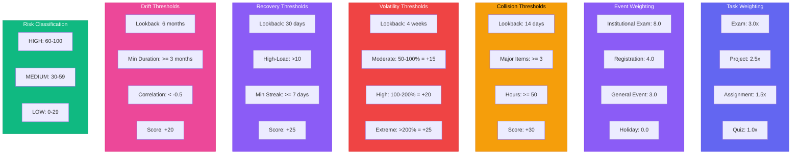
```mermaid
graph TB
    subgraph TW["Task Weighting"]
        TW1["Exam: 3.0x"]
        TW2["Project: 2.5x"]
        TW3["Assignment: 1.5x"]
        TW4["Quiz: 1.0x"]
    end
    
    subgraph EW["Event Weighting"]
        EW1["Institutional Exam: 8.0"]
        EW2["Registration: 4.0"]
        EW3["General Event: 3.0"]
        EW4["Holiday: 0.0"]
    end
    
    subgraph CT["Collision Thresholds"]
        CT1["Lookback: 14 days"]
        CT2["Major Items: >= 3"]
        CT3["Hours: >= 50"]
        CT4["Score: +30"]
    end
    
    subgraph VT["Volatility Thresholds"]
        VT1["Lookback: 4 weeks"]
        VT2["Moderate: 50-100% = +15"]
        VT3["High: 100-200% = +20"]
        VT4["Extreme: >200% = +25"]
    end
    
    subgraph RT["Recovery Thresholds"]
        RT1["Lookback: 30 days"]
        RT2["High-Load: >10"]
        RT3["Min Streak: >= 7 days"]
        RT4["Score: +25"]
    end
    
    subgraph DT["Drift Thresholds"]
        DT1["Lookback: 6 months"]
        DT2["Min Duration: >= 3 months"]
        DT3["Correlation: < -0.5"]
        DT4["Score: +20"]
    end
    
    subgraph RC["Risk Classification"]
        RC1["HIGH: 60-100"]
        RC2["MEDIUM: 30-59"]
        RC3["LOW: 0-29"]
    end
    
    style TW fill:#6366f1,stroke:#4f46e5,color:#fff
    style EW fill:#8b5cf6,stroke:#7c3aed,color:#fff
    style CT fill:#f59e0b,stroke:#d97706,color:#000
    style VT fill:#ef4444,stroke:#dc2626,color:#fff
    style RT fill:#8b5cf6,stroke:#7c3aed,color:#fff
    style DT fill:#ec4899,stroke:#db2777,color:#fff
    style RC fill:#10b981,stroke:#059669,color:#fff
```

---

## 🧪 Testing & Quality

### Test Coverage Architecture

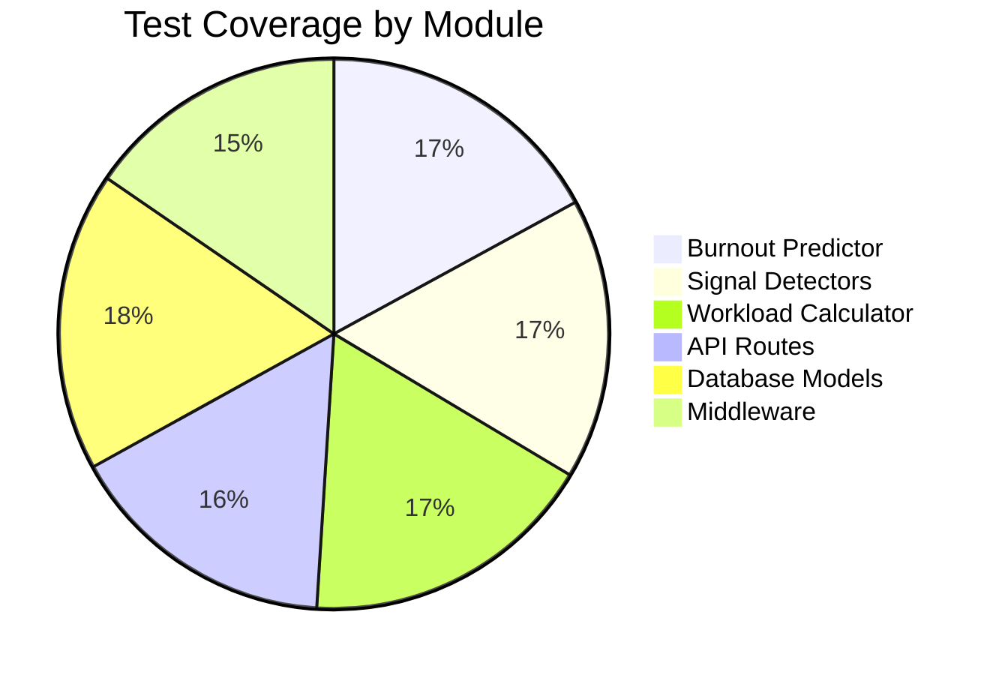
```mermaid
pie title Test Coverage by Module
    "Burnout Predictor" : 94
    "Signal Detectors" : 91
    "Workload Calculator" : 96
    "API Routes" : 88
    "Database Models" : 97
    "Middleware" : 85
```

### Test Execution Flow

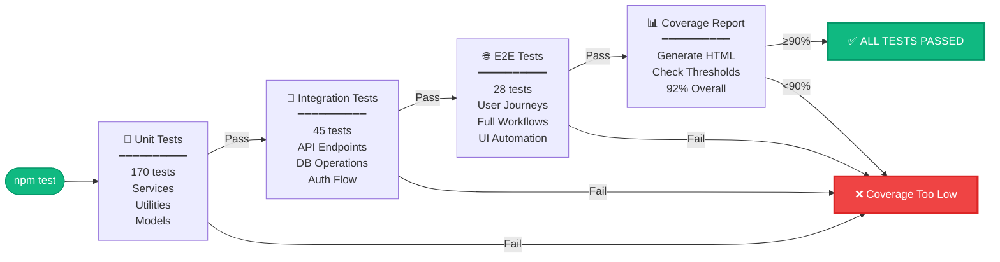
```mermaid
flowchart LR
    START([npm test]) --> UNIT[🧪 Unit Tests<br/>━━━━━━━━━━<br/>170 tests<br/>Services<br/>Utilities<br/>Models]
    
    UNIT -->|Pass| INT[🔗 Integration Tests<br/>━━━━━━━━━━<br/>45 tests<br/>API Endpoints<br/>DB Operations<br/>Auth Flow]
    
    INT -->|Pass| E2E[🌐 E2E Tests<br/>━━━━━━━━━━<br/>28 tests<br/>User Journeys<br/>Full Workflows<br/>UI Automation]
    
    E2E -->|Pass| COV[📊 Coverage Report<br/>━━━━━━━━━━<br/>Generate HTML<br/>Check Thresholds<br/>92% Overall]
    
    COV -->|≥90%| SUCCESS[✅ ALL TESTS PASSED]
    COV -->|<90%| FAIL[❌ Coverage Too Low]
    
    UNIT -->|Fail| FAIL
    INT -->|Fail| FAIL
    E2E -->|Fail| FAIL
    
    style START fill:#10b981,stroke:#059669,color:#fff
    style SUCCESS fill:#10b981,stroke:#059669,color:#fff,stroke-width:3px
    style FAIL fill:#ef4444,stroke:#dc2626,color:#fff,stroke-width:3px
```

---

## 🚀 Deployment Architecture

### Production Infrastructure

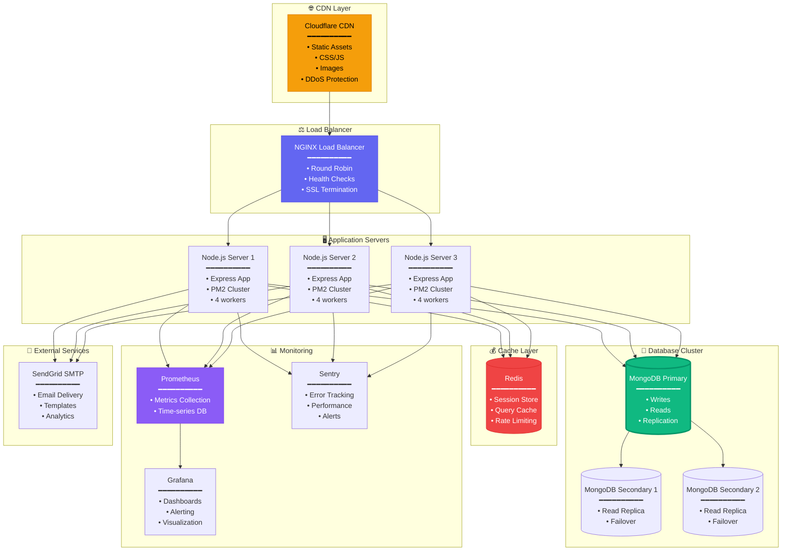
```mermaid
graph TB
    subgraph "🌐 CDN Layer"
        CDN[Cloudflare CDN<br/>━━━━━━━━━━<br/>• Static Assets<br/>• CSS/JS<br/>• Images<br/>• DDoS Protection]
    end
    
    subgraph "⚖️ Load Balancer"
        LB[NGINX Load Balancer<br/>━━━━━━━━━━<br/>• Round Robin<br/>• Health Checks<br/>• SSL Termination]
    end
    
    subgraph "🖥️ Application Servers"
        APP1[Node.js Server 1<br/>━━━━━━━━━━<br/>• Express App<br/>• PM2 Cluster<br/>• 4 workers]
        
        APP2[Node.js Server 2<br/>━━━━━━━━━━<br/>• Express App<br/>• PM2 Cluster<br/>• 4 workers]
        
        APP3[Node.js Server 3<br/>━━━━━━━━━━<br/>• Express App<br/>• PM2 Cluster<br/>• 4 workers]
    end
    
    subgraph "💾 Database Cluster"
        PRIMARY[(MongoDB Primary<br/>━━━━━━━━━━<br/>• Writes<br/>• Reads<br/>• Replication)]
        
        SECONDARY1[(MongoDB Secondary 1<br/>━━━━━━━━━━<br/>• Read Replica<br/>• Failover)]
        
        SECONDARY2[(MongoDB Secondary 2<br/>━━━━━━━━━━<br/>• Read Replica<br/>• Failover)]
    end
    
    subgraph "💰 Cache Layer"
        REDIS[(Redis<br/>━━━━━━━━━━<br/>• Session Store<br/>• Query Cache<br/>• Rate Limiting)]
    end
    
    subgraph "📊 Monitoring"
        PROM[Prometheus<br/>━━━━━━━━━━<br/>• Metrics Collection<br/>• Time-series DB]
        
        GRAF[Grafana<br/>━━━━━━━━━━<br/>• Dashboards<br/>• Alerting<br/>• Visualization]
        
        SENTRY[Sentry<br/>━━━━━━━━━━<br/>• Error Tracking<br/>• Performance<br/>• Alerts]
    end
    
    subgraph "📧 External Services"
        SMTP[SendGrid SMTP<br/>━━━━━━━━━━<br/>• Email Delivery<br/>• Templates<br/>• Analytics]
    end
    
    CDN --> LB
    LB --> APP1
    LB --> APP2
    LB --> APP3
    
    APP1 --> REDIS
    APP2 --> REDIS
    APP3 --> REDIS
    
    APP1 --> PRIMARY
    APP2 --> PRIMARY
    APP3 --> PRIMARY
    
    PRIMARY --> SECONDARY1
    PRIMARY --> SECONDARY2
    
    APP1 --> SMTP
    APP2 --> SMTP
    APP3 --> SMTP
    
    APP1 --> PROM
    APP2 --> PROM
    APP3 --> PROM
    
    PROM --> GRAF
    APP1 --> SENTRY
    APP2 --> SENTRY
    APP3 --> SENTRY
    
    style CDN fill:#f59e0b,stroke:#d97706,color:#000
    style LB fill:#6366f1,stroke:#4f46e5,color:#fff
    style PRIMARY fill:#10b981,stroke:#059669,color:#fff,stroke-width:3px
    style REDIS fill:#ef4444,stroke:#dc2626,color:#fff
    style PROM fill:#8b5cf6,stroke:#7c3aed,color:#fff
```

### Docker Deployment Flow

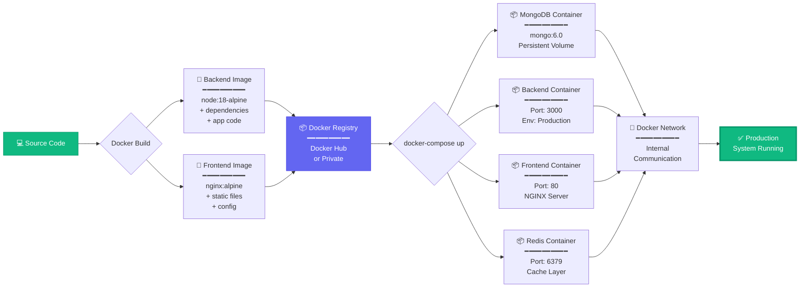
```mermaid
flowchart LR
    CODE[💻 Source Code] --> BUILD{Docker Build}
    
    BUILD --> IMG1[🐳 Backend Image<br/>━━━━━━━━━━<br/>node:18-alpine<br/>+ dependencies<br/>+ app code]
    
    BUILD --> IMG2[🐳 Frontend Image<br/>━━━━━━━━━━<br/>nginx:alpine<br/>+ static files<br/>+ config]
    
    IMG1 --> REG[📦 Docker Registry<br/>━━━━━━━━━━<br/>Docker Hub<br/>or Private]
    IMG2 --> REG
    
    REG --> DEPLOY{docker-compose up}
    
    DEPLOY --> C1[📦 MongoDB Container<br/>━━━━━━━━━━<br/>mongo:6.0<br/>Persistent Volume]
    
    DEPLOY --> C2[📦 Backend Container<br/>━━━━━━━━━━<br/>Port: 3000<br/>Env: Production]
    
    DEPLOY --> C3[📦 Frontend Container<br/>━━━━━━━━━━<br/>Port: 80<br/>NGINX Server]
    
    DEPLOY --> C4[📦 Redis Container<br/>━━━━━━━━━━<br/>Port: 6379<br/>Cache Layer]
    
    C1 --> NET[🔗 Docker Network<br/>━━━━━━━━━━<br/>Internal<br/>Communication]
    C2 --> NET
    C3 --> NET
    C4 --> NET
    
    NET --> LIVE[✅ Production<br/>System Running]
    
    style CODE fill:#10b981,stroke:#059669,color:#fff
    style REG fill:#6366f1,stroke:#4f46e5,color:#fff
    style LIVE fill:#10b981,stroke:#059669,color:#fff,stroke-width:3px
```

---

## 📞 Support & Community

<table>
<tr>
<td align="center" width="25%">
<h3>📚 Documentation</h3>
<a href="docs/API.md">API Reference</a><br/>
<a href="docs/ARCHITECTURE.md">Architecture Guide</a><br/>
<a href="docs/DEPLOYMENT.md">Deployment Guide</a>
</td>
<td align="center" width="25%">
<h3>🐛 Issues</h3>
<a href="https://github.com/yourusername/burnout-prediction-system/issues">Report Bug</a><br/>
<a href="https://github.com/yourusername/burnout-prediction-system/issues/new?template=feature_request.md">Request Feature</a>
</td>
<td align="center" width="25%">
<h3>💬 Discussions</h3>
<a href="https://github.com/yourusername/burnout-prediction-system/discussions">Community Forum</a><br/>
<a href="https://discord.gg/burnout-predict">Discord Server</a>
</td>
<td align="center" width="25%">
<h3>📧 Contact</h3>
<a href="mailto:support@burnoutpredict.edu">Email Support</a><br/>
<a href="https://twitter.com/burnoutpredict">Twitter</a>
</td>
</tr>
</table>

---

## 🗺️ Roadmap

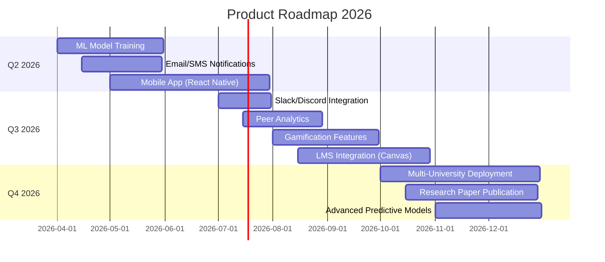
```mermaid
gantt
    title Product Roadmap 2026
    dateFormat YYYY-MM-DD
    section Q2 2026
    ML Model Training           :2026-04-01, 60d
    Email/SMS Notifications     :2026-04-15, 45d
    Mobile App (React Native)   :2026-05-01, 90d
    
    section Q3 2026
    Slack/Discord Integration   :2026-07-01, 30d
    Peer Analytics              :2026-07-15, 45d
    Gamification Features       :2026-08-01, 60d
    LMS Integration (Canvas)    :2026-08-15, 75d
    
    section Q4 2026
    Multi-University Deployment :2026-10-01, 90d
    Research Paper Publication  :2026-10-15, 75d
    Advanced Predictive Models  :2026-11-01, 60d
```

---

## 🤝 Contributing

We welcome contributions! See our [Contributing Guide](CONTRIBUTING.md) for details.

### Quick Start for Contributors

```bash
# Fork & clone
git clone https://github.com/YOUR_USERNAME/burnout-prediction-system.git

# Create feature branch
git checkout -b feature/amazing-feature

# Make changes & test
npm test
npm run lint

# Commit with conventional commits
git commit -m "feat: add email notifications"

# Push & create PR
git push origin feature/amazing-feature
```

---

## 📄 License

MIT License - see [LICENSE](LICENSE) for details.

---

<div align="center">

### 📊 Project Stats


---

### Made with ❤️ for student wellness

**Preventing burnout, one prediction at a time.**

[](docs/DEPLOYMENT.md)
[](#-demo)
[](docs/)

**[⬆ Back to Top](#-academic-burnout-prediction-system)**

</div>
