<div align="center">

# 🧠 Academic Burnout Prediction System

### AI-Powered Student Wellness & Workload Intelligence Platform

[](https://opensource.org/licenses/MIT)
[](https://nodejs.org/)
[](https://www.mongodb.com/)
[](https://expressjs.com/)
[](http://makeapullrequest.com)
[]()

**[Quick Start](#-quick-start)** • **[Architecture](#-system-architecture)** • **[API Docs](#-api-reference)** • **[Live Demo](#-demo)**

</div>

---

## 🎯 Problem & Impact

<table>
<tr>
<td align="center" width="33%">
<h3>📊 73%</h3>
Students experience burnout<br/>during academic semesters
</td>
<td align="center" width="33%">
<h3>⏰ 3-4 weeks</h3>
Average detection time<br/>after burnout onset
</td>
<td align="center" width="33%">
<h3>🚨 12%</h3>
Seek help before<br/>reaching critical stress
</td>
</tr>
</table>

## 💡 Our Solution: 2-3 Week Early Prediction

```mermaid
graph LR
    A[📚 Tasks] --> E{🧠 AI Engine}
    B[📅 Calendar] --> E
    C[📈 Grades] --> E
    D[⏱️ Workload] --> E
    
    E --> F[🎯 Collision]
    E --> G[⚡ Volatility]
    E --> H[🛌 Recovery]
    E --> I[📉 Drift]
    
    F --> J[🚨 Risk Score]
    G --> J
    H --> J
    I --> J
    
    J --> K[👨‍🏫 Proctor Alert]
    J --> L[📧 Notification]
    J --> M[📊 Dashboard]
    
    style E fill:#6366f1,stroke:#4f46e5,color:#fff,stroke-width:3px
    style J fill:#ef4444,stroke:#dc2626,color:#fff,stroke-width:3px
    style K fill:#10b981,stroke:#059669,color:#fff
    style L fill:#10b981,stroke:#059669,color:#fff
    style M fill:#10b981,stroke:#059669,color:#fff
```



---

## 🏗️ Complete System Architecture

### High-Level System Design

```mermaid
graph TB
    subgraph "🎨 Presentation Layer"
        UI1[Student Dashboard<br/>• Risk Visualization<br/>• Task Management<br/>• Grade Tracking]
        UI2[Proctor Dashboard<br/>• At-Risk Students<br/>• Intervention Tools<br/>• Analytics]
        UI3[Admin Console<br/>• User Management<br/>• Calendar Control<br/>• System Config]
    end
    
    subgraph "🔐 Security Layer"
        AUTH[JWT Authentication<br/>• Role-based Access<br/>• Token Validation<br/>• Session Management]
        RATE[Rate Limiter<br/>• 100 req/min<br/>• IP-based throttling]
    end
    
    subgraph "🔌 API Gateway Layer"
        ROUTER[Express Router<br/>• /api/auth<br/>• /api/burnout<br/>• /api/tasks<br/>• /api/calendar<br/>• /api/grades<br/>• /api/proctor<br/>• /api/admin]
        VALID[Request Validator<br/>• Schema Validation<br/>• Type Checking<br/>• Sanitization]
    end
    
    subgraph "🧠 Business Logic Layer"
        BP[Burnout Predictor<br/>• Multi-Signal Analysis<br/>• Risk Scoring<br/>• Trend Detection]
        WL[Workload Calculator<br/>• Daily Scores<br/>• Weekly Aggregation<br/>• Task/Event Weighting]
        INT[Intervention Manager<br/>• Alert Triggering<br/>• Message Queue<br/>• Status Tracking]
    end
    
    subgraph "🔍 Detection Algorithms Layer"
        D1[🎯 Collision Detector<br/>━━━━━━━━━━━━━━━<br/>Scan: Next 14 days<br/>Flag: ≥3 major items/week<br/>OR ≥50 hours/week<br/>━━━━━━━━━━━━━━━<br/>Score Impact: +30]
        
        D2[⚡ Volatility Detector<br/>━━━━━━━━━━━━━━━<br/>Scan: Last 4 weeks<br/>Compare: Current vs Avg<br/>50-100% → +15<br/>100-200% → +20<br/>200%+ → +25<br/>━━━━━━━━━━━━━━━<br/>Score Impact: +25 max]
        
        D3[🛌 Recovery Detector<br/>━━━━━━━━━━━━━━━<br/>Scan: Last 30 days<br/>Track: High-load streaks<br/>Flag: ≥7 consecutive days<br/>High = score >10<br/>━━━━━━━━━━━━━━━<br/>Score Impact: +25]
        
        D4[📉 Drift Detector<br/>━━━━━━━━━━━━━━━<br/>Scan: Last 6 months<br/>Correlate: Workload ↔ Grades<br/>Flag: Negative trend ≥3mo<br/>Workload ↑ + Grades ↓<br/>━━━━━━━━━━━━━━━<br/>Score Impact: +20]
    end
    
    subgraph "💾 Data Access Layer"
        DAO1[Task Repository<br/>• CRUD Operations<br/>• Deadline Queries<br/>• Completion Tracking]
        DAO2[Event Repository<br/>• Calendar CRUD<br/>• Institutional Events<br/>• Personal Events]
        DAO3[Signal Repository<br/>• Risk Score Storage<br/>• Historical Analysis<br/>• Trend Queries]
        DAO4[Workload Repository<br/>• Daily Score Storage<br/>• Weekly Aggregation<br/>• Time-series Queries]
    end
    
    subgraph "🗄️ Database Layer"
        DB[(MongoDB<br/>━━━━━━━━━━<br/>Collections:<br/>• users<br/>• tasks<br/>• events<br/>• grades<br/>• signals<br/>• workload_scores<br/>• interventions)]
    end
    
    subgraph "⏰ Background Jobs"
        CRON1[Daily Analysis Job<br/>• Runs: 2:00 AM<br/>• Analyzes all students<br/>• Generates signals<br/>• Triggers alerts]
        CRON2[Weekly Report Job<br/>• Runs: Sunday 6:00 AM<br/>• Proctor summaries<br/>• Trend reports<br/>• Email distribution]
    end
    
    UI1 --> AUTH
    UI2 --> AUTH
    UI3 --> AUTH
    
    AUTH --> RATE
    RATE --> ROUTER
    ROUTER --> VALID
    
    VALID --> BP
    VALID --> WL
    VALID --> INT
    
    BP --> D1
    BP --> D2
    BP --> D3
    BP --> D4
    
    D1 --> DAO1
    D1 --> DAO2
    D2 --> DAO4
    D3 --> DAO4
    D4 --> DAO3
    D4 --> DAO4
    
    WL --> DAO1
    WL --> DAO2
    WL --> DAO4
    
    INT --> DAO3
    
    DAO1 --> DB
    DAO2 --> DB
    DAO3 --> DB
    DAO4 --> DB
    
    CRON1 --> BP
    CRON2 --> DAO3
    
    style BP fill:#6366f1,stroke:#4f46e5,color:#fff,stroke-width:3px
    style D1 fill:#f59e0b,stroke:#d97706,color:#000,stroke-width:2px
    style D2 fill:#ef4444,stroke:#dc2626,color:#fff,stroke-width:2px
    style D3 fill:#8b5cf6,stroke:#7c3aed,color:#fff,stroke-width:2px
    style D4 fill:#ec4899,stroke:#db2777,color:#fff,stroke-width:2px
    style DB fill:#10b981,stroke:#059669,color:#fff,stroke-width:3px
    style CRON1 fill:#14b8a6,stroke:#0d9488,color:#fff
    style CRON2 fill:#14b8a6,stroke:#0d9488,color:#fff
```



---

## 🔄 Complete Data Flow Architecture

### Request-Response Flow

```mermaid
sequenceDiagram
    participant S as 👨‍🎓 Student
    participant UI as 🎨 Dashboard
    participant API as 🔌 API Server
    participant AUTH as 🔐 Auth
    participant WL as ⚖️ Workload Service
    participant BP as 🧠 Burnout Predictor
    participant D1 as 🎯 Collision
    participant D2 as ⚡ Volatility
    participant D3 as 🛌 Recovery
    participant D4 as 📉 Drift
    participant DB as 💾 MongoDB
    participant NOTIF as 📧 Notification
    participant P as 👨‍🏫 Proctor
    
    Note over S,P: SCENARIO: Student adds new exam task
    
    S->>UI: Add Task: "Calculus Exam"<br/>Type: exam, Effort: 5h<br/>Deadline: Feb 15
    UI->>API: POST /api/tasks
    API->>AUTH: Validate JWT Token
    AUTH-->>API: ✅ Authenticated
    API->>DB: Save Task Document
    DB-->>API: Task Created
    
    Note over API,WL: AUTOMATIC WORKLOAD RECALCULATION
    
    API->>WL: calculateWorkloadScores(studentId)
    WL->>DB: Fetch all tasks for next 30 days
    WL->>DB: Fetch all calendar events
    DB-->>WL: Tasks + Events
    
    Note over WL: Daily Score Calculation<br/>Task Score: (5h × 3.0) = 15<br/>Event Score: 0<br/>Daily Total: 15
    
    WL->>DB: Save WorkloadScore document
    WL-->>API: Workload Updated
    API-->>UI: ✅ Task Added
    
    Note over API,BP: TRIGGER BURNOUT ANALYSIS
    
    API->>BP: predictBurnout(studentId)
    
    par Parallel Signal Detection
        BP->>D1: detectCollisions()
        D1->>DB: Query next 14 days<br/>tasks + events
        DB-->>D1: 4 major items found<br/>in next 7 days
        D1-->>BP: hasCollision: true<br/>score: +30
        
        BP->>D2: detectVolatility()
        D2->>DB: Query last 4 weeks<br/>workload scores
        DB-->>D2: Week 1-3 avg: 47h<br/>Week 4: 107h
        Note over D2: Change: +127%
        D2-->>BP: hasVolatility: true<br/>score: +20
        
        BP->>D3: detectRecoveryGap()
        D3->>DB: Query last 30 days<br/>workload scores
        DB-->>D3: 12 consecutive days<br/>score >10
        D3-->>BP: hasRecoveryDeficit: true<br/>score: +25
        
        BP->>D4: detectPerformanceDrift()
        D4->>DB: Query last 6 months<br/>workload + grades
        DB-->>D4: No correlation issue
        D4-->>BP: hasDrift: false<br/>score: +0
    end
    
    Note over BP: TOTAL RISK SCORE<br/>Collision: 30<br/>Volatility: 20<br/>Recovery: 25<br/>Drift: 0<br/>━━━━━━━━━━<br/>TOTAL: 75 (🔴 HIGH)
    
    BP->>DB: Save Signal document<br/>score: 75, risk: "high"
    DB-->>BP: ✅ Signal Saved
    
    Note over BP,NOTIF: RISK THRESHOLD EXCEEDED
    
    BP->>NOTIF: Trigger High Risk Alert
    NOTIF->>DB: Get Student + Proctor info
    DB-->>NOTIF: Student: John Doe<br/>Proctor: Dr. Smith
    
    par Notification Dispatch
        NOTIF->>S: 📧 Email: "High Burnout Risk Alert"
        NOTIF->>P: 📧 Email: "Student Alert: John Doe"
        NOTIF->>DB: Log intervention required
    end
    
    BP-->>API: ✅ Analysis Complete
    API-->>UI: Risk Score Updated
    
    Note over S,P: Student sees updated dashboard<br/>Proctor receives alert
    
    UI->>S: Display: 🔴 Risk Score: 75<br/>• 4 major deadlines next week<br/>• 127% workload increase<br/>• 12 days without recovery
    
    P->>UI: View Proctor Dashboard
    UI->>API: GET /api/proctor/students
    API->>DB: Fetch students with latest signals
    DB-->>API: Student list with risk scores
    API-->>UI: Students data
    UI->>P: Display: 🚨 John Doe - Risk: 75<br/>[Send Message] button
```



---

## 🧬 Burnout Prediction Algorithm

### Multi-Signal Detection System

```mermaid
flowchart TD
    START([🎬 START ANALYSIS]) --> FETCH[📥 Fetch Student Data<br/>• Tasks<br/>• Events<br/>• Grades<br/>• Workload History]
    
    FETCH --> PARALLEL{🔀 Run 4 Detectors<br/>in Parallel}
    
    PARALLEL --> C1[🎯 COLLISION DETECTOR]
    PARALLEL --> V1[⚡ VOLATILITY DETECTOR]
    PARALLEL --> R1[🛌 RECOVERY DETECTOR]
    PARALLEL --> D1[📉 DRIFT DETECTOR]
    
    C1 --> C2{Next 14 days:<br/>≥3 major items/week<br/>OR ≥50 hours?}
    C2 -->|YES| C3[✅ Collision Found<br/>Score: +30]
    C2 -->|NO| C4[❌ No Collision<br/>Score: +0]
    
    V1 --> V2[Calculate Last<br/>4 Weeks Average]
    V2 --> V3{Current Week vs Avg}
    V3 -->|50-100% ↑| V4[⚠️ Moderate Spike<br/>Score: +15]
    V3 -->|100-200% ↑| V5[🔥 High Spike<br/>Score: +20]
    V3 -->|>200% ↑| V6[💥 Extreme Spike<br/>Score: +25]
    V3 -->|<50% ↑| V7[✅ Normal<br/>Score: +0]
    
    R1 --> R2[Scan Last 30 Days<br/>for High-Load Days]
    R2 --> R3{≥7 Consecutive<br/>Days Score >10?}
    R3 -->|YES| R4[⚠️ Recovery Deficit<br/>Score: +25]
    R3 -->|NO| R5[✅ Adequate Recovery<br/>Score: +0]
    
    D1 --> D2[Get 6 Month<br/>Workload & Grade Trends]
    D2 --> D3{Workload ↑<br/>while Grades ↓<br/>for ≥3 months?}
    D3 -->|YES| D4[📉 Performance Drift<br/>Score: +20]
    D3 -->|NO| D5[✅ No Drift<br/>Score: +0]
    
    C3 --> AGG[📊 AGGREGATE SCORES]
    C4 --> AGG
    V4 --> AGG
    V5 --> AGG
    V6 --> AGG
    V7 --> AGG
    R4 --> AGG
    R5 --> AGG
    D4 --> AGG
    D5 --> AGG
    
    AGG --> TOTAL{Calculate<br/>Total Score}
    
    TOTAL --> CLASS{Classify Risk}
    CLASS -->|0-29| LOW[🟢 LOW RISK<br/>Healthy Pattern<br/>Continue Monitoring]
    CLASS -->|30-59| MED[🟡 MEDIUM RISK<br/>Warning Signs<br/>Increase Support]
    CLASS -->|60-100| HIGH[🔴 HIGH RISK<br/>Immediate Action<br/>Trigger Intervention]
    
    LOW --> SAVE[💾 Save Signal to DB]
    MED --> SAVE
    HIGH --> SAVE
    
    SAVE --> NOTIFY{Risk Level?}
    NOTIFY -->|HIGH| ALERT[🚨 Send Alerts:<br/>• Email Student<br/>• Notify Proctor<br/>• Dashboard Update]
    NOTIFY -->|MEDIUM| DASH[📊 Update Dashboard]
    NOTIFY -->|LOW| DASH
    
    ALERT --> END([✅ ANALYSIS COMPLETE])
    DASH --> END
    
    style START fill:#10b981,stroke:#059669,color:#fff
    style PARALLEL fill:#6366f1,stroke:#4f46e5,color:#fff
    style C1 fill:#f59e0b,stroke:#d97706,color:#000
    style V1 fill:#ef4444,stroke:#dc2626,color:#fff
    style R1 fill:#8b5cf6,stroke:#7c3aed,color:#fff
    style D1 fill:#ec4899,stroke:#db2777,color:#fff
    style HIGH fill:#ef4444,stroke:#dc2626,color:#fff,stroke-width:3px
    style MED fill:#f59e0b,stroke:#d97706,color:#000,stroke-width:2px
    style LOW fill:#10b981,stroke:#059669,color:#fff,stroke-width:2px
    style END fill:#10b981,stroke:#059669,color:#fff
```



---

## 📊 Workload Calculation Engine

### Task & Event Scoring System


---

## 🗄️ Database Architecture

### Complete Entity Relationship Diagram


### Data Flow Between Collections

```mermaid
flowchart LR
    subgraph "📥 INPUT COLLECTIONS"
        TASK[(TASK<br/>━━━━━━━━<br/>Student's<br/>assignments<br/>exams<br/>projects)]
        EVENT[(CALENDAR_EVENT<br/>━━━━━━━━<br/>Institutional<br/>+ Personal<br/>events)]
        GRADE[(GRADE<br/>━━━━━━━━<br/>Exam scores<br/>Performance<br/>history)]
    end
    
    subgraph "⚙️ PROCESSING"
        WL[WORKLOAD<br/>CALCULATOR<br/>━━━━━━━━<br/>Daily scores<br/>Weekly totals<br/>Breakdown]
        BP[BURNOUT<br/>PREDICTOR<br/>━━━━━━━━<br/>4 Detectors<br/>Risk scoring<br/>Classification]
    end
    
    subgraph "💾 OUTPUT COLLECTIONS"
        WLSCORE[(WORKLOAD_SCORE<br/>━━━━━━━━<br/>Time-series<br/>Aggregated<br/>scores)]
        SIG[(SIGNAL<br/>━━━━━━━━<br/>Risk scores<br/>Detected<br/>patterns)]
        INT[(INTERVENTION<br/>━━━━━━━━<br/>Proctor<br/>actions<br/>Follow-ups)]
    end
    
    TASK --> WL
    EVENT --> WL
    WL --> WLSCORE
    
    WLSCORE --> BP
    TASK --> BP
    EVENT --> BP
    GRADE --> BP
    
    BP --> SIG
    SIG --> INT
    
    style WL fill:#6366f1,stroke:#4f46e5,color:#fff,stroke-width:2px
    style BP fill:#8b5cf6,stroke:#7c3aed,color:#fff,stroke-width:2px
    style SIG fill:#ef4444,stroke:#dc2626,color:#fff,stroke-width:2px
```



---

## 🔍 Signal Detector Deep Dive

### 1. Collision Detector - Deadline Overload Analysis


### 2. Volatility Detector - Workload Spike Analysis


### 3. Recovery Detector - Rest Period Analysis


### 4. Drift Detector - Performance Correlation Analysis


---

## 📡 Complete API Architecture

### API Route Hierarchy


### Authentication & Authorization Flow

```mermaid
sequenceDiagram
    participant C as 👤 Client
    participant API as 🔌 API Server
    participant AUTH as 🔐 Auth Middleware
    participant DB as 💾 Database
    participant CTRL as 🎯 Controller
    
    Note over C,CTRL: USER REGISTRATION
    
    C->>API: POST /api/auth/register<br/>{name, email, password, role}
    API->>DB: Check if email exists
    DB-->>API: Email available
    API->>API: Hash password (bcrypt)
    API->>DB: Create user document
    DB-->>API: User created
    API->>API: Generate JWT token
    API-->>C: {token, user}<br/>Status: 201
    
    Note over C,CTRL: USER LOGIN
    
    C->>API: POST /api/auth/login<br/>{email, password}
    API->>DB: Find user by email
    DB-->>API: User found
    API->>API: Compare password hash
    alt Password Valid
        API->>API: Generate JWT token
        API-->>C: {token, user}<br/>Status: 200
    else Password Invalid
        API-->>C: Error: Invalid credentials<br/>Status: 401
    end
    
    Note over C,CTRL: PROTECTED ENDPOINT ACCESS
    
    C->>API: GET /api/burnout/analysis<br/>Headers: {Authorization: "Bearer <token>"}
    API->>AUTH: Verify JWT token
    AUTH->>AUTH: Decode & validate
    alt Token Valid
        AUTH->>DB: Find user by ID from token
        DB-->>AUTH: User found
        AUTH->>CTRL: Attach user to request
        CTRL->>DB: Fetch burnout data
        DB-->>CTRL: Data retrieved
        CTRL-->>API: Process response
        API-->>C: {score, risk, signals}<br/>Status: 200
    else Token Invalid/Expired
        AUTH-->>C: Error: Unauthorized<br/>Status: 401
    end
    
    Note over C,CTRL: ROLE-BASED ACCESS (Proctor Only)
    
    C->>API: GET /api/proctor/students<br/>Headers: {Authorization: "Bearer <token>"}
    API->>AUTH: Verify JWT token
    AUTH->>AUTH: Decode & check role
    alt Role = Proctor
        AUTH->>CTRL: Allow access
        CTRL->>DB: Fetch assigned students
        DB-->>CTRL: Student list
        CTRL-->>C: {students}<br/>Status: 200
    else Role ≠ Proctor
        AUTH-->>C: Error: Forbidden<br/>Status: 403
    end
```



---

## 🚀 Quick Start

### Installation (5 Minutes)

```bash
# 1️⃣ Clone repository
git clone https://github.com/yourusername/burnout-prediction-system.git
cd burnout-prediction-system

# 2️⃣ Backend setup
cd backend
npm install

# 3️⃣ Environment configuration
cp .env.example .env
# Edit .env with your MongoDB URI

# 4️⃣ Start MongoDB (if local)
mongod --dbpath /path/to/data

# 5️⃣ Start server
npm start
# ✅ Server running on http://localhost:3000

# 6️⃣ Open frontend
# Navigate to frontend/pages/login.html
```

### Environment Variables

```env
# 🗄️ Database
MONGODB_URI=mongodb://localhost:27017/burnout-system
MONGODB_TEST_URI=mongodb://localhost:27017/burnout-test

# 🔐 Authentication
JWT_SECRET=your_super_secret_key_minimum_32_characters_long
JWT_EXPIRES_IN=7d

# 🌐 Server
PORT=3000
NODE_ENV=development

# 📧 Email Notifications (Optional)
SMTP_HOST=smtp.gmail.com
SMTP_PORT=587
SMTP_USER=noreply@yourdomain.com
SMTP_PASS=your_app_password_here

# ⏰ Scheduled Jobs
ENABLE_DAILY_ANALYSIS=true
DAILY_ANALYSIS_TIME=02:00

# 📊 System Configuration
HIGH_RISK_THRESHOLD=60
MEDIUM_RISK_THRESHOLD=30
COLLISION_THRESHOLD=3
VOLATILITY_MODERATE=50
VOLATILITY_HIGH=100
VOLATILITY_EXTREME=200
```

---

## 📊 Real-World Example

### Complete Student Journey


### Detailed Week 4 Breakdown

<table>
<tr>
<th>Date</th>
<th>Tasks</th>
<th>Events</th>
<th>Daily Score</th>
<th>Status</th>
</tr>
<tr>
<td><b>Feb 3 Mon</b></td>
<td>2 Assignments (6h)</td>
<td>Workshop (3h)</td>
<td>15</td>
<td>🟡 High</td>
</tr>
<tr>
<td><b>Feb 4 Tue</b></td>
<td>1 Quiz (1h)</td>
<td>-</td>
<td>8</td>
<td>🟢 Normal</td>
</tr>
<tr>
<td><b>Feb 5 Wed</b></td>
<td>1 Exam (5h)</td>
<td>Registration (4h)</td>
<td>23</td>
<td>🔴 Critical</td>
</tr>
<tr>
<td><b>Feb 6 Thu</b></td>
<td>1 Project (8h)</td>
<td>Tour (8h)</td>
<td>44</td>
<td>🔴 Critical</td>
</tr>
<tr>
<td><b>Feb 7 Fri</b></td>
<td>2 Exams (9h)</td>
<td>-</td>
<td>27</td>
<td>🔴 Critical</td>
</tr>
<tr>
<td><b>Feb 8 Sat</b></td>
<td>1 Assignment (3h)</td>
<td>Welfare Visit (3h)</td>
<td>12</td>
<td>🟡 High</td>
</tr>
<tr>
<td><b>Feb 9 Sun</b></td>
<td>-</td>
<td>-</td>
<td>3</td>
<td>🟢 Recovery</td>
</tr>
<tr>
<td colspan="3"><b>WEEKLY TOTAL</b></td>
<td><b>132</b></td>
<td><b>🔴 CRITICAL</b></td>
</tr>
</table>

### Risk Analysis Results

```
┌─────────────────────────────────────────────────────────────┐
│  🚨 BURNOUT ANALYSIS - JOHN DOE                             │
│  Generated: Feb 8, 2026 10:30 AM                            │
├─────────────────────────────────────────────────────────────┤
│                                                             │
│  RISK SCORE: 75/100  ━━━━━━━━━━  🔴 HIGH RISK              │
│                                                             │
│  ┌─────────────────────────────────────────────────────┐   │
│  │ 🎯 COLLISION DETECTOR             Score: +30/30    │   │
│  ├─────────────────────────────────────────────────────┤   │
│  │ Status: ✅ DETECTED                                 │   │
│  │                                                     │   │
│  │ Findings:                                           │   │
│  │ • 7 major items in next 7 days                      │   │
│  │ • Total hours: 132 (threshold: 50)                  │   │
│  │                                                     │   │
│  │ Items:                                              │   │
│  │ • Feb 5: Data Structures Exam (5h)                  │   │
│  │ • Feb 5: Course Registration (4h)                   │   │
│  │ • Feb 6: ML Project Submission (8h)                 │   │
│  │ • Feb 6: Student Tour (8h)                          │   │
│  │ • Feb 7: Calculus Midterm (5h)                      │   │
│  │ • Feb 7: Physics Exam (4h)                          │   │
│  │ • Feb 8: Welfare Visit (3h)                         │   │
│  └─────────────────────────────────────────────────────┘   │
│                                                             │
│  ┌─────────────────────────────────────────────────────┐   │
│  │ ⚡ VOLATILITY DETECTOR             Score: +20/25    │   │
│  ├─────────────────────────────────────────────────────┤   │
│  │ Status: ✅ DETECTED (High Spike)                    │   │
│  │                                                     │   │
│  │ Findings:                                           │   │
│  │ • Week 1-3 Average: 47h/week                        │   │
│  │ • Week 4 Current: 132h/week                         │   │
│  │ • Change: +180% (High spike threshold: 100%)        │   │
│  │                                                     │   │
│  │ Weekly Breakdown:                                   │   │
│  │ • Week 1: 45h                                       │   │
│  │ • Week 2: 42h                                       │   │
│  │ • Week 3: 54h                                       │   │
│  │ • Week 4: 132h ⚠️                                   │   │
│  └─────────────────────────────────────────────────────┘   │
│                                                             │
│  ┌─────────────────────────────────────────────────────┐   │
│  │ 🛌 RECOVERY DETECTOR               Score: +25/25    │   │
│  ├─────────────────────────────────────────────────────┤   │
│  │ Status: ✅ DETECTED                                 │   │
│  │                                                     │   │
│  │ Findings:                                           │   │
│  │ • 18 consecutive high-load days                     │   │
│  │ • Start Date: Jan 22, 2026                          │   │
│  │ • End Date: Feb 8, 2026                             │   │
│  │ • Average Daily Score: 16.3                         │   │
│  │ • Threshold: 7 consecutive days                     │   │
│  │                                                     │   │
│  │ Last Recovery Day: Jan 21 (17 days ago)             │   │
│  └─────────────────────────────────────────────────────┘   │
│                                                             │
│  ┌─────────────────────────────────────────────────────┐   │
│  │ 📉 DRIFT DETECTOR                  Score: +0/20     │   │
│  ├─────────────────────────────────────────────────────┤   │
│  │ Status: ❌ NOT DETECTED                             │   │
│  │                                                     │   │
│  │ Findings:                                           │   │
│  │ • Workload increasing (+35% over 6 months)          │   │
│  │ • Grades stable (82% avg, -2% change)               │   │
│  │ • Correlation: -0.23 (threshold: -0.5)              │   │
│  │                                                     │   │
│  │ Performance is holding despite workload increase    │   │
│  └─────────────────────────────────────────────────────┘   │
│                                                             │
│  ━━━━━━━━━━━━━━━━━━━━━━━━━━━━━━━━━━━━━━━━━━━━━━━━━━━━━━━  │
│                                                             │
│  📋 RECOMMENDATIONS:                                        │
│                                                             │
│  🎯 Immediate Actions (Next 24 hours):                      │
│  1. Contact your proctor Dr. Smith                          │
│  2. Reschedule non-critical deadlines if possible           │
│  3. Request extension for Feb 6 project                     │
│                                                             │
│  🛌 Recovery Plan (This Weekend):                           │
│  4. Block out Saturday afternoon for complete rest          │
│  5. Schedule 8+ hours sleep each night                      │
│  6. Avoid taking on new commitments                         │
│                                                             │
│  📚 Study Strategy:                                         │
│  7. Focus on Feb 5-7 exams first (highest priority)         │
│  8. Use Pomodoro technique (25min work / 5min break)        │
│  9. Join study groups to share workload                     │
│                                                             │
│  📞 Support Resources:                                      │
│  • Counseling Services: counseling@university.edu           │
│  • Time Management Workshop: Feb 10 @ 2 PM                  │
│  • Peer Support Hotline: 1-800-STUDENT                      │
│                                                             │
│  ━━━━━━━━━━━━━━━━━━━━━━━━━━━━━━━━━━━━━━━━━━━━━━━━━━━━━━━  │
│                                                             │
│  🚨 INTERVENTION STATUS:                                    │
│                                                             │
│  Dr. Smith has been notified of your high-risk status.      │
│  Expect outreach within 24 hours.                           │
│                                                             │
│  [Acknowledge Alert] [Contact Proctor] [View Resources]     │
│                                                             │
└─────────────────────────────────────────────────────────────┘
```

---

## 🔧 Configuration Deep Dive

### System Constants & Thresholds


---

## 🧪 Testing & Quality

### Test Coverage Architecture


### Test Execution Flow

```mermaid
flowchart LR
    START([npm test]) --> UNIT[🧪 Unit Tests<br/>━━━━━━━━━━<br/>170 tests<br/>Services<br/>Utilities<br/>Models]
    
    UNIT -->|Pass| INT[🔗 Integration Tests<br/>━━━━━━━━━━<br/>45 tests<br/>API Endpoints<br/>DB Operations<br/>Auth Flow]
    
    INT -->|Pass| E2E[🌐 E2E Tests<br/>━━━━━━━━━━<br/>28 tests<br/>User Journeys<br/>Full Workflows<br/>UI Automation]
    
    E2E -->|Pass| COV[📊 Coverage Report<br/>━━━━━━━━━━<br/>Generate HTML<br/>Check Thresholds<br/>92% Overall]
    
    COV -->|≥90%| SUCCESS[✅ ALL TESTS PASSED]
    COV -->|<90%| FAIL[❌ Coverage Too Low]
    
    UNIT -->|Fail| FAIL
    INT -->|Fail| FAIL
    E2E -->|Fail| FAIL
    
    style START fill:#10b981,stroke:#059669,color:#fff
    style SUCCESS fill:#10b981,stroke:#059669,color:#fff,stroke-width:3px
    style FAIL fill:#ef4444,stroke:#dc2626,color:#fff,stroke-width:3px
```



---

## 🚀 Deployment Architecture

### Production Infrastructure

```mermaid
graph TB
    subgraph "🌐 CDN Layer"
        CDN[Cloudflare CDN<br/>━━━━━━━━━━<br/>• Static Assets<br/>• CSS/JS<br/>• Images<br/>• DDoS Protection]
    end
    
    subgraph "⚖️ Load Balancer"
        LB[NGINX Load Balancer<br/>━━━━━━━━━━<br/>• Round Robin<br/>• Health Checks<br/>• SSL Termination]
    end
    
    subgraph "🖥️ Application Servers"
        APP1[Node.js Server 1<br/>━━━━━━━━━━<br/>• Express App<br/>• PM2 Cluster<br/>• 4 workers]
        
        APP2[Node.js Server 2<br/>━━━━━━━━━━<br/>• Express App<br/>• PM2 Cluster<br/>• 4 workers]
        
        APP3[Node.js Server 3<br/>━━━━━━━━━━<br/>• Express App<br/>• PM2 Cluster<br/>• 4 workers]
    end
    
    subgraph "💾 Database Cluster"
        PRIMARY[(MongoDB Primary<br/>━━━━━━━━━━<br/>• Writes<br/>• Reads<br/>• Replication)]
        
        SECONDARY1[(MongoDB Secondary 1<br/>━━━━━━━━━━<br/>• Read Replica<br/>• Failover)]
        
        SECONDARY2[(MongoDB Secondary 2<br/>━━━━━━━━━━<br/>• Read Replica<br/>• Failover)]
    end
    
    subgraph "💰 Cache Layer"
        REDIS[(Redis<br/>━━━━━━━━━━<br/>• Session Store<br/>• Query Cache<br/>• Rate Limiting)]
    end
    
    subgraph "📊 Monitoring"
        PROM[Prometheus<br/>━━━━━━━━━━<br/>• Metrics Collection<br/>• Time-series DB]
        
        GRAF[Grafana<br/>━━━━━━━━━━<br/>• Dashboards<br/>• Alerting<br/>• Visualization]
        
        SENTRY[Sentry<br/>━━━━━━━━━━<br/>• Error Tracking<br/>• Performance<br/>• Alerts]
    end
    
    subgraph "📧 External Services"
        SMTP[SendGrid SMTP<br/>━━━━━━━━━━<br/>• Email Delivery<br/>• Templates<br/>• Analytics]
    end
    
    CDN --> LB
    LB --> APP1
    LB --> APP2
    LB --> APP3
    
    APP1 --> REDIS
    APP2 --> REDIS
    APP3 --> REDIS
    
    APP1 --> PRIMARY
    APP2 --> PRIMARY
    APP3 --> PRIMARY
    
    PRIMARY --> SECONDARY1
    PRIMARY --> SECONDARY2
    
    APP1 --> SMTP
    APP2 --> SMTP
    APP3 --> SMTP
    
    APP1 --> PROM
    APP2 --> PROM
    APP3 --> PROM
    
    PROM --> GRAF
    APP1 --> SENTRY
    APP2 --> SENTRY
    APP3 --> SENTRY
    
    style CDN fill:#f59e0b,stroke:#d97706,color:#000
    style LB fill:#6366f1,stroke:#4f46e5,color:#fff
    style PRIMARY fill:#10b981,stroke:#059669,color:#fff,stroke-width:3px
    style REDIS fill:#ef4444,stroke:#dc2626,color:#fff
    style PROM fill:#8b5cf6,stroke:#7c3aed,color:#fff
```



### Docker Deployment Flow

```mermaid
flowchart LR
    CODE[💻 Source Code] --> BUILD{Docker Build}
    
    BUILD --> IMG1[🐳 Backend Image<br/>━━━━━━━━━━<br/>node:18-alpine<br/>+ dependencies<br/>+ app code]
    
    BUILD --> IMG2[🐳 Frontend Image<br/>━━━━━━━━━━<br/>nginx:alpine<br/>+ static files<br/>+ config]
    
    IMG1 --> REG[📦 Docker Registry<br/>━━━━━━━━━━<br/>Docker Hub<br/>or Private]
    IMG2 --> REG
    
    REG --> DEPLOY{docker-compose up}
    
    DEPLOY --> C1[📦 MongoDB Container<br/>━━━━━━━━━━<br/>mongo:6.0<br/>Persistent Volume]
    
    DEPLOY --> C2[📦 Backend Container<br/>━━━━━━━━━━<br/>Port: 3000<br/>Env: Production]
    
    DEPLOY --> C3[📦 Frontend Container<br/>━━━━━━━━━━<br/>Port: 80<br/>NGINX Server]
    
    DEPLOY --> C4[📦 Redis Container<br/>━━━━━━━━━━<br/>Port: 6379<br/>Cache Layer]
    
    C1 --> NET[🔗 Docker Network<br/>━━━━━━━━━━<br/>Internal<br/>Communication]
    C2 --> NET
    C3 --> NET
    C4 --> NET
    
    NET --> LIVE[✅ Production<br/>System Running]
    
    style CODE fill:#10b981,stroke:#059669,color:#fff
    style REG fill:#6366f1,stroke:#4f46e5,color:#fff
    style LIVE fill:#10b981,stroke:#059669,color:#fff,stroke-width:3px
```



---

## 📞 Support & Community

<table>
<tr>
<td align="center" width="25%">
<h3>📚 Documentation</h3>
<a href="docs/API.md">API Reference</a><br/>
<a href="docs/ARCHITECTURE.md">Architecture Guide</a><br/>
<a href="docs/DEPLOYMENT.md">Deployment Guide</a>
</td>
<td align="center" width="25%">
<h3>🐛 Issues</h3>
<a href="https://github.com/yourusername/burnout-prediction-system/issues">Report Bug</a><br/>
<a href="https://github.com/yourusername/burnout-prediction-system/issues/new?template=feature_request.md">Request Feature</a>
</td>
<td align="center" width="25%">
<h3>💬 Discussions</h3>
<a href="https://github.com/yourusername/burnout-prediction-system/discussions">Community Forum</a><br/>
<a href="https://discord.gg/burnout-predict">Discord Server</a>
</td>
<td align="center" width="25%">
<h3>📧 Contact</h3>
<a href="mailto:support@burnoutpredict.edu">Email Support</a><br/>
<a href="https://twitter.com/burnoutpredict">Twitter</a>
</td>
</tr>
</table>

---

## 🗺️ Roadmap


---

## 🤝 Contributing

We welcome contributions! See our [Contributing Guide](CONTRIBUTING.md) for details.

### Quick Start for Contributors

```bash
# Fork & clone
git clone https://github.com/YOUR_USERNAME/burnout-prediction-system.git

# Create feature branch
git checkout -b feature/amazing-feature

# Make changes & test
npm test
npm run lint

# Commit with conventional commits
git commit -m "feat: add email notifications"

# Push & create PR
git push origin feature/amazing-feature
```

---

## 📄 License

MIT License - see [LICENSE](LICENSE) for details.

---

<div align="center">

### 📊 Project Stats


---

### Made with ❤️ for student wellness

**Preventing burnout, one prediction at a time.**

[](docs/DEPLOYMENT.md)
[](#-demo)
[](docs/)

**[⬆ Back to Top](#-academic-burnout-prediction-system)**

</div>
